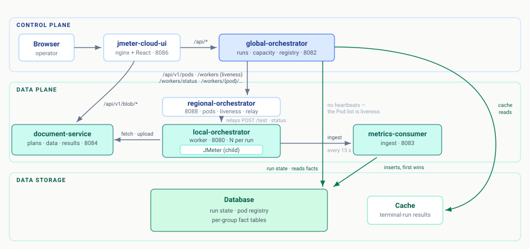
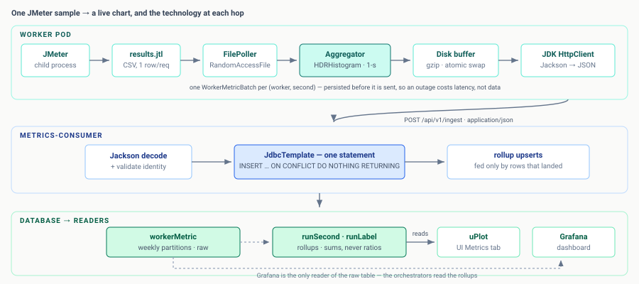

# jmeter-cloud

Distributed JMeter-as-a-service platform. Upload a `.jmx` plan from the
UI, click **Start**, and watch per-second metrics stream into Grafana
while the test is still running. Fully runnable on a laptop via
`docker compose up`.

## Architecture



The **control plane** (UI → global-orchestrator) drives a **data plane** of
per-pod local-orchestrators; each runs JMeter, tails its JTL, and publishes
per-second Avro metrics to Kafka. A consumer lands them in partitioned
Postgres, where the UI's native charts and Grafana read them back. How a single
JMeter sample becomes a live chart:



New here? Start the stack with [`RUNBOOK.md`](./RUNBOOK.md).

## What you get

| Subsystem | Stack | Role |
|-----------|-------|------|
| `jmeter-local-orchestrator` | Spring Boot 3 + Java 17 + Apache JMeter 5.6.3 | Worker-side runtime. One pod per JMeter; REST API for plan/data/run lifecycle; tails the JTL through a 1-s tumbling-window aggregator and publishes Avro `WorkerMetric` records to Kafka. The image bakes JMeter so the same artifact runs the orchestrator and its child JMeter process. |
| `jmeter-global-orchestrator` | Spring Boot 3 + Java 17 | Control plane. `POST /api/v1/runs` claims IDLE pods from the registry with `SELECT … FOR UPDATE SKIP LOCKED`, fans out `POST /api/v1/test` in a bounded thread pool, exposes lazy-refreshed status + per-label metrics rollup. **Track F (live):** per-region claims via `fleetAllocation: [{region, count}]`, capacity rollup at `GET /api/v1/regions`, strict / `?bestEffort=true` modes with structured per-region shortfall on 503. Pod registry: pods self-register on boot and heartbeat every 30 s; a sweeper marks stale pods LOST after 90 s. |
| `jmeter-metrics-consumer` | Spring Boot 3 + spring-kafka | Batch listener: reads `WorkerMetric` from Kafka and bulk-inserts per-second rows into Postgres via multi-row `INSERT … ON CONFLICT DO NOTHING`. DLQ + standalone replay tool included. |
| `document-service` | Spring Boot 3 | HTTP gateway for blobs (test plans, data zips, JTL results). `LocalFsBlobStore` implements a pluggable `BlobStore` interface backed by the local filesystem. Server-issued ULID keys, sha256 computed during the upload stream, paginated `GET /api/v1/blob` listing with `X-Name` / `X-Description` / `X-Type` tagging. |
| `jmeter-cloud-ui` | React 18 + Vite 5.4 + TypeScript 5.6 | Control-plane SPA: home, run launcher with type-filtered blob dropdowns and **dual-mode multi-region allocation widget** (Visual stepper cards / typed Form rows), polling runs list, run detail with embedded Grafana iframe + per-pod live log tail, multi-run side-by-side comparison, blob library with drag-and-drop upload + XHR progress. Bundle ≈ 65 KB gzip. |
| `kafka` | Confluent KRaft Kafka 7.6 + Schema Registry + Kafka UI | Single-broker KRaft locally. Canonical Avro schema lives in `kafka/schemas/WorkerMetric.avsc`. |
| `postgres` | Postgres 16 + Flyway 10 | Two databases: `jmetercloud_metrics` (partitioned `metrics."workerMetric"` table, weekly partitions) and `jmetercloud_globalrun` (run state + pod registry). Three least-privilege users: `metricsWriter`, `metricsReader`, `globalOrchestratorWriter`. |
| `grafana` | Grafana 11 + Prometheus 2.55 + kafka-exporter + postgres-exporter | Five auto-provisioned dashboards: per-test live metrics, orchestrator JVM, JMeter JVM, Kafka broker, Postgres. Anonymous viewer auth in local-dev. |
| `jmeter` (base image) | Apache JMeter 5.6.3 | The standalone JMeter image (separate from the bundled-orchestrator image). Useful as a base for building custom JMeter images with a curated plugin set. |

## Get started

### Prerequisites

| Tool | Version | Notes |
|------|---------|-------|
| Docker Desktop | 4.x+ | Multi-arch (amd64 + arm64); works on Apple Silicon. |
| Java 17 + Maven 3.9 | any | Only if you want to run a service on the host instead of in a container. |

### Bring up the full stack

```bash
git clone <this-repo> && cd jmeter-cloud
docker compose up -d --build
```

First build is ~5 min on cold cache (downloads JMeter, builds the four
Spring Boot fat JARs, builds the React bundle). Subsequent runs reuse
the Docker layer cache and start in ~30 s.

When everything is healthy, `docker compose ps` shows **13 long-running
services** plus two one-shot init jobs (`topic-init`, `flyway-migrate`):

| Service | URL | What |
|---------|-----|------|
| **jmeter-cloud-ui** | http://localhost:8086/ | The user-facing control plane. Start here. |
| jmeter-global-orchestrator | http://localhost:8082/actuator/health | Control plane API. Owns run state + pod registry + spawns worker containers via the Capacity tab. |
| jmeter-metrics-consumer | http://localhost:8083/actuator/health | Kafka → Postgres. No public REST API. |
| document-service | http://localhost:8084/actuator/health | Blob storage gateway. |
| kafka-ui | http://localhost:8085/ | Browse Kafka topics + messages. |
| Prometheus | http://localhost:9090/ | All scrape targets `up=1`. |
| Grafana | http://localhost:3000/dashboards | 5 dashboards (anonymous viewer in local). |
| Postgres | `localhost:5432` (user `jmetercloud`, password `localdev`) | Two databases. |
| Schema Registry | http://localhost:8081/subjects | Avro schemas registered by the orchestrator. |

> **Workers are spun up on demand.** As of Phase 6 of the Capacity
> rework (2026-05-12), there are **no static** `orchestrator-1` /
> `orchestrator-2` services. Worker containers are created per
> application via the Capacity tab in the UI (`/capacity/{appName}` →
> **+ Provision Worker(s)**). They appear in `docker ps` as
> `{appName}-{region}-worker-{n}` and reach each other via the shared
> docker network — no host port mapping.

### Run your first test

The fastest path is through the UI:

```bash
open http://localhost:8086
```

Click **Blobs → drag a `.jmx` file** → set Type=`testPlan`. Then
**Runs → New run** → pick the plan from the dropdown → Start. The page
redirects to `/runs/{runId}` with a live-refreshing fleet-member table,
embedded Grafana panel, and per-pod log tail. Watch the per-second
metrics stream into the run-detail Metrics tab (and Grafana at
http://localhost:3000) while the test is still running.

### Compose profiles

| Profile | Services | Use |
|---------|----------|-----|
| `minimal` | kafka core only | Tightest dev loop. Skips the UI, Postgres, Grafana, document-service, and the greenfield services. |
| `default` | The full stack above | Standard local-dev. Plain `docker compose up` activates this profile via `COMPOSE_PROFILES=default` in `.env`. |

> The legacy `multiRegion` profile is gone (it existed only to spin a second static orchestrator). Per-region fan-out is now exercised by provisioning workers across regions for an application via the Capacity tab.

## REST API — Swagger UI

Every REST-bearing service serves interactive Swagger UI at runtime:

| Service | Swagger UI |
|---------|------------|
| jmeter-local-orchestrator | http://localhost:8080/swagger-ui.html |
| jmeter-global-orchestrator | http://localhost:8082/swagger-ui.html |
| document-service | http://localhost:8084/swagger-ui.html |

`jmeter-metrics-consumer` is a Kafka consumer with no business REST
surface; it exposes only the Spring Boot Actuator endpoints.
`jmeter-cloud-ui` is a static SPA; its API calls reverse-proxy through
nginx to the global-orchestrator (`/api/*` routes) and the
document-service (`/api/v1/blob*` route).

## Conventions

Headline naming rule: **camelCase everywhere** — REST paths, JSON keys,
on-disk directory names, file artifacts, Kafka topic names, shell script
filenames. The exceptions are the tool-imposed lowercase / hyphenated
cases (`docker-compose.yml`, `pom.xml`, `Makefile`, etc.).
