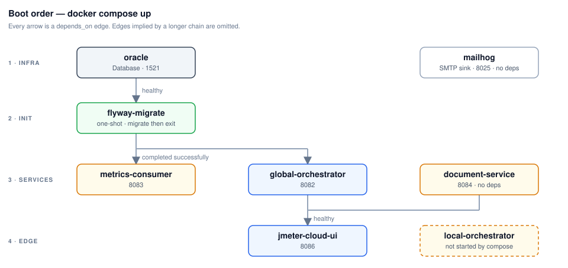

# RUNBOOK — operating jmeter-cloud locally

How to bring the platform up, run a test, watch it, and tear it down. For *what the
platform is* and how the pieces fit together, see [`README.md`](./README.md).

> **TL;DR**
> ```bash
> cp .env.example .env          # one-time; fill ANTHROPIC_API_KEY only if you want AI features
> docker compose up -d --build  # full stack
> open http://localhost:8086    # the UI
> docker compose down           # stop (keep data)   ·   add -v to wipe volumes
> ```

---

## 1. Prerequisites

| Need | Why |
|------|-----|
| Docker Engine + Compose v2 (`docker compose`, not `docker-compose`) | Everything runs as containers, composed from per-subsystem fragments via `include:`. |
| ~7 GB free RAM for Docker | Oracle Free (~2.2 GB) + Redis + MailHog + 3 Spring services + UI, plus the workers you start. |
| Ports free on the host | See the port table below — mainly `1521`, `8082–8086`. |

No JDK, Maven, or Node is required to *run* the stack — images build inside Docker. You only
need those to develop a single service outside its container.

## 2. One-time setup

```bash
cp .env.example .env
```

`.env` is git-ignored and holds local config. Everything in it has a working local default.
The only secret is `ANTHROPIC_API_KEY` — **leave it blank to keep the AI-analysis features
disabled**; paste an Anthropic key to enable them. The database passwords are
throwaway local credentials, fine as-is.

## 3. Bring the stack up

```bash
# Full stack (default profile): oracle + redis + mailhog + the 3 services + UI — no workers
docker compose up -d --build
```

First build is ~5 min cold; subsequent starts ~30 s. Compose starts things in dependency
order and waits on health checks, so a one-shot `up` is safe — services that depend on
Oracle wait until it is healthy (~40 s from an empty volume).



**Variants:**

```bash
docker compose up -d --build oracle flyway-migrate     # just the data substrate
docker compose ps                                   # health of every container
docker compose logs -f global-orchestrator          # follow one service's logs
```

Workers (`jmeter-local-orchestrator`) are **not** started by Compose. Under the default
`PROVISIONING_MODE=STATIC` you run one yourself (`docker run … jmeter-local-orchestrator:dev`
on the `jmeter-cloud_default` network with `POD_NAME`, `RUN_ID`, `JTL_PATH`, `SENTINEL_PATH`,
`METRICS_INGEST_URL` set) and **declare** it into a group's pool —
`PUT /api/v1/applicationGroups/{groupId}/capacity/{region}/pods/{podName}` or the UI's
**Capacity** page; every application in the group draws on that pool. On-demand provisioning
needs `PROVISIONING_MODE=DYNAMIC` and kind regions (§8b).

## 4. Service endpoints & ports

**This table is the canonical port allocation** — no two services may claim the
same host port. Ports are configurable in `.env`.

| Port | Service | URL | Health check |
|------|---------|-----|--------------|
| `1521` | Oracle Database Free (`FREEPDB1`) | `localhost:1521/FREEPDB1` (`system` / `localdev`; the one schema owner `CARDZATE_DB_GRAF` — the consumer connects as it; the hub as `GLOBAL_ORCHESTRATOR_WRITER` / `METRICS_READER` / `METRICS_PURGER`) | `healthcheck.sh` (in the image) |
| `1025` | MailHog SMTP (dev sink the hub mails to) | `localhost:1025` | — |
| `6379` | Redis (the hub's cache) | `localhost:6379` | `redis-cli ping` |
| `8025` | MailHog UI (dev SMTP) | http://localhost:8025 | — |
| `8080` | Worker HTTP API (`jmeter-local-orchestrator`) | http://localhost:8080 | `GET /actuator/health` |
| `8082` | global-orchestrator | http://localhost:8082 | `GET /actuator/health` |
| `8083` | metrics-consumer | http://localhost:8083 | `GET /actuator/health` |
| `8084` | document-service | http://localhost:8084 | `GET /actuator/health` |
| `8086` | **UI** | http://localhost:8086 | `GET /healthz` |
| `8088` | jmeter-regional-orchestrator (in each kind cluster; NodePort `30088` on the node) | — | `GET /actuator/health` |
| `9999` | JMX, worker → its JMeter child | `localhost` only, never off-host | — |

Overrides: `HTTP_PORT` on each service, `JMX_PORT` for the JMX bridge.

## 5. Run your first test

Easiest path is the UI:

1. Open **http://localhost:8086**.
2. **Capacity** → pick the application's group → **declare** the worker you started (§3) for its region; under DYNAMIC with kind regions the same page spins one.
3. **Documents** → upload a `.jmx` test plan.
4. **Runs → New run** → choose the plan, set fleet size/region → **Start**.
5. You land on `/runs/{runId}` with the live fleet table, the native uPlot **Metrics** tab,
   and per-pod logs. Metrics appear within ~1–2 s of the first sample.

Prefer headless? Drive the same flow from each service's Swagger UI
(e.g. document-service at http://localhost:8084/swagger-ui.html to
upload, global-orchestrator at http://localhost:8082/swagger-ui.html to
launch and poll).

The metric pipeline behind that run:


## 6. Watch it

- **Platform health, one call:** `curl -s localhost:8082/api/v1/platform/health | jq` — the hub's tree
  (itself + Oracle pools + cache, metrics-consumer, document-service, every data center's regional +
  workers), refreshed every minute; the UI Home page renders exactly this. `?refresh=true` probes now.
- **Live per-run charts:** the UI run-detail **Metrics** tab (native uPlot over the run's `<GROUP_ID>_METRICS` rows, bucketed 15/30/60 s).
- **Logs:** `docker compose logs -f <service>` — JSON, one record per line, each carrying
  `runId` / `actor`.

## 7. Tear down

```bash
docker compose down        # stop + remove containers; the Oracle volume PERSISTS
docker compose down -v     # also delete volumes — full reset (wipes all runs + metrics)
docker compose stop        # pause without removing containers
```

To rebuild one service after a code change:

```bash
docker compose up -d --build global-orchestrator
```

## 8. Run it on Kubernetes (kind)

The whole platform also runs in-cluster — every service ships Kustomize
manifests in `kube/kustomize/` (base + `local`/`dev`/`test`/`prod` overlays,
the hosted blueprint); the `local` overlays are composed by the umbrella at
`infra/deploy/k8s/kind` (conventions + the image inventory live in that
directory's README). **Service names match
compose names exactly**, so every inter-service URL default works unchanged.

```bash
# 0. Prereqs: kind + kubectl installed; images built locally.
#    --provenance=false is REQUIRED for kind side-loading (BuildKit
#    attestations break the containerd import).
kind create cluster --name jmeter-cloud

docker build --provenance=false -t jmeter-cloud-flyway:dev oracle/
docker build --provenance=false -t jmeter-metrics-consumer:dev jmeter-metrics-consumer/
docker build --provenance=false -t document-service:dev document-service/
docker build --provenance=false -t jmeter-global-orchestrator:dev jmeter-global-orchestrator/
docker build --provenance=false -t jmeter-cloud-ui:dev jmeter-cloud-ui/
docker build --provenance=false -t jmeter-regional-orchestrator:dev jmeter-regional-orchestrator/
docker build --provenance=false -t jmeter-local-orchestrator:dev \
  -f jmeter-local-orchestrator/docker/Dockerfile .

kind load docker-image --name jmeter-cloud \
  jmeter-cloud-flyway:dev jmeter-metrics-consumer:dev document-service:dev \
  jmeter-global-orchestrator:dev jmeter-cloud-ui:dev jmeter-local-orchestrator:dev \
  jmeter-regional-orchestrator:dev
# (gvenzl/oracle-free / mailhog are public multi-arch images — the
# kubelet pulls them; multi-arch images won't side-load anyway.)

# 1. Boot everything (namespace jmeter-cloud + all services):
kubectl apply -k infra/deploy/k8s/kind

# 2. Reach it (no host ports on kind — port-forward):
kubectl -n jmeter-cloud port-forward svc/jmeter-cloud-ui 8086:80  # UI

# 3. Tear down:
kubectl delete namespace jmeter-cloud   # stack only (PVCs included)
kind delete cluster --name jmeter-cloud # whole cluster
```

**Boot expectations:** Kubernetes has no `depends_on` — pods start
concurrently and converge via readiness gates. A restart or two on the
Java services while oracle starts and the Flyway Job applies
migrations is **normal** (a from-scratch boot converges in well under a
minute); don't "fix" it with ordering hacks. Worker pods are created by the
in-cluster `jmeter-regional-orchestrator` (`REGION=local`), which the
global reaches at `REGIONS=local=http://jmeter-regional-orchestrator:8088`
under `PROVISIONING_MODE=DYNAMIC` — the kind overlay sets both; the compose
stack alone has no cluster and stays STATIC (see §8b for the two-cluster
setup).

On the hosted platform there is no umbrella: each service's `jules.yml`
pipeline builds `Dockerfile.privateCloud` and applies
`kube/kustomize/overlays/<env>` into the service's own namespace
(`<sealId>d<appId>-<service>-<env>`), the credential Secrets created out of
band first (each overlay's `kustomization.yml` lists the keys). Fill the
`<sealId>`/`<cluster>`/`<platform-domain>` placeholders and work through
`infra/deploy/k8s/privateCloudHardening.md` (secrets sourcing, password
rotation, NetworkPolicies, TLS, storage, the log-based alerting obligation,
the auth exposure gate).

## 8b. Two data centers locally (kind `na-east` + `na-west`)

The private-cloud shape: the hub stays on compose, and each kind cluster runs
only a `jmeter-regional-orchestrator` that creates that region's worker Pods
and relays the hub's worker calls. The global never holds a cluster credential.

```bash
docker compose up -d                                   # the hub
infra/deploy/k8s/local/bootstrapRegions.sh up          # clusters na-east + na-west
# then, in .env:  PROVISIONING_MODE=DYNAMIC
#                 REGIONS=na-east=http://na-east-control-plane:30088,na-west=http://na-west-control-plane:30088
docker compose up -d global-orchestrator
curl -s localhost:8082/api/v1/regions/status | jq      # both reachable: true

infra/deploy/k8s/local/bootstrapRegions.sh bridge      # after any compose restart
infra/deploy/k8s/local/bootstrapRegions.sh down        # delete both clusters
```

Each cluster's node joins `jmeter-cloud_default`, so pods reach the hub
through bridge Services named like the compose services and the hub reaches
the regional at `http://<cluster>-control-plane:30088` (NodePort). The
`kind`-node DNS name is the discriminator — both clusters use NodePort 30088.

## 9. Troubleshooting

| Symptom | Likely cause / fix |
|---------|--------------------|
| A service is `unhealthy` in `docker compose ps` | Check its logs: `docker compose logs <svc>`. Java services have `restart: unless-stopped` and self-heal; the one-shot `flyway-migrate` job should exit `0`. |
| Workers go `unreachable` mid-run after a rebuild | Rebuilding `jmeter-local-orchestrator:dev` while a run is live triggers an image-mismatch drain by the PodRecycler — looks like an OOM but isn't. Don't rebuild the worker image during a run. |
| No metrics on the chart | Confirm `metrics-consumer` is healthy (its `ingestProgress` health key goes DOWN after 5 idle minutes — that's normal between runs) and the run actually claimed a pod (Capacity tab shows BUSY). On the worker, `GET /api/v1/ready` should show `ingestReachable: true`. |
| Port already in use on `up` | Edit the offending `*_PORT` in `.env` and re-run `docker compose up -d`. |
| AI tabs missing in the UI | `ANTHROPIC_API_KEY` is blank in `.env` (expected default). Paste a key and restart `global-orchestrator`. |
| Want a clean slate | `docker compose down -v` then `docker compose up -d --build`. |
| (kind) A member FAILS with `region … unreachable` or `worker lost: no heartbeat` while the worker pod is alive and the test completed | Docker Desktop can pause its Linux VM when the host is idle (Resource Saver) — the ENTIRE kind cluster freezes, heartbeats stop, and on wake the PodSweeper sees >90 s staleness and fails the run's members. Not a platform bug: keep the session active during runs (e.g. poll `GET /api/v1/runs/{runId}/status`), or disable Resource Saver in Docker Desktop settings. The pod re-heartbeats back to READY on its own. Also note: `GET /runs/{runId}` returns the STORED row; only `/runs/{runId}/status` triggers the lazy refresh that detects completion. |

## 10. Where to go next

- System map & architecture diagram → [`README.md`](./README.md)
- Per-subsystem behavior → each subsystem's own `README.md`
