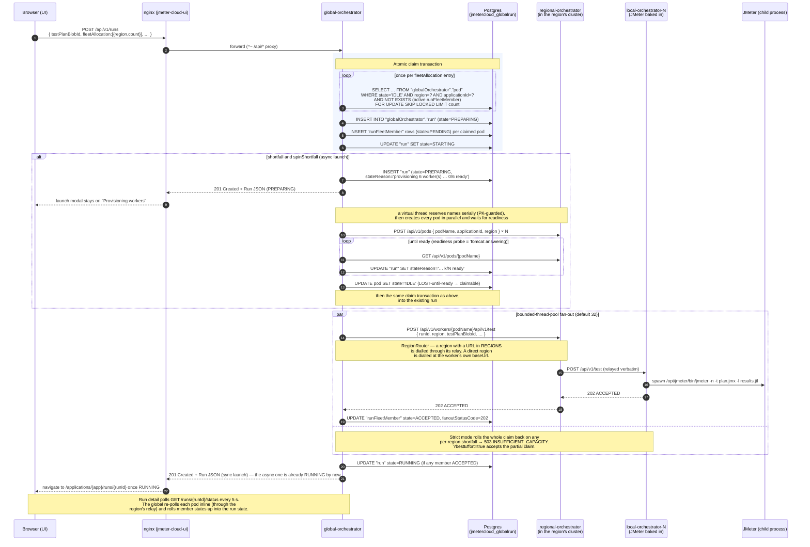
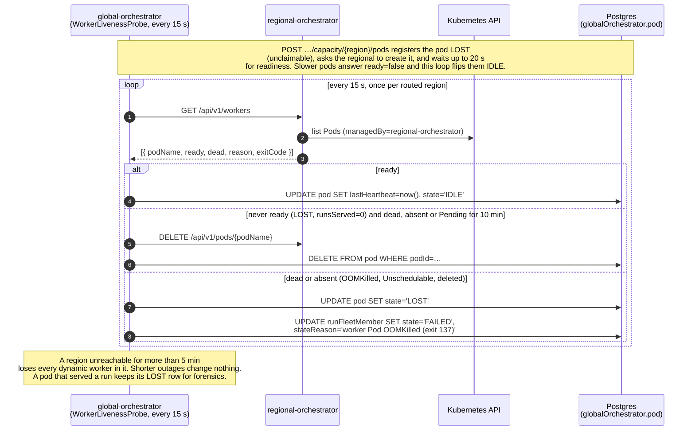
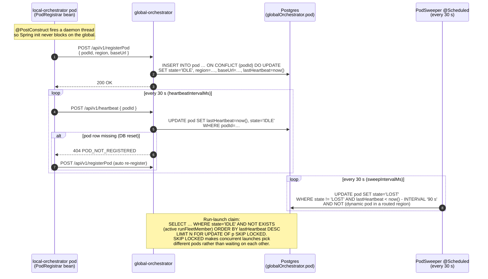
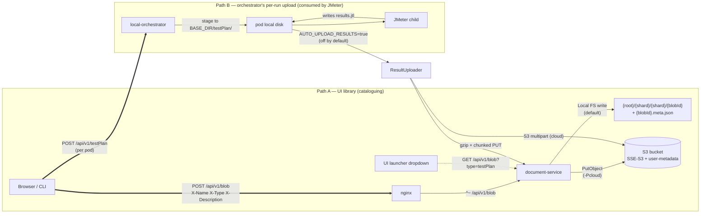
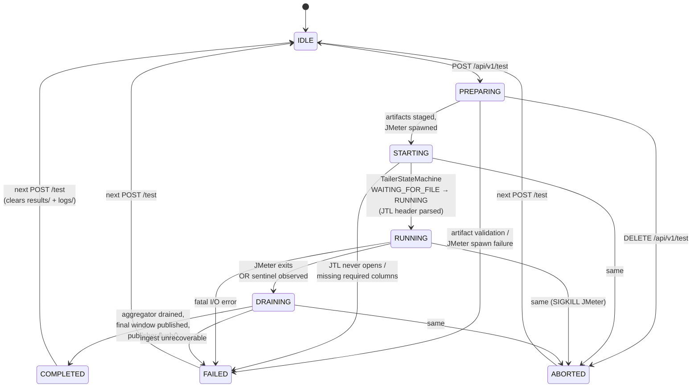
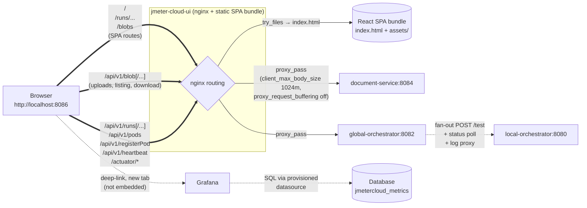

# Flow diagrams

How the components interact at runtime. The diagrams carry the detail — the
prose only says what a diagram cannot.

1. [Control plane — starting a run](#1-control-plane--starting-a-run)
2. [Pod registry — register, heartbeat, sweep, claim](#2-pod-registry--register-heartbeat-sweep-claim)
3. [Data plane — metrics from JMeter to Grafana](#3-data-plane--metrics-from-jmeter-to-grafana)
4. [Artifact plane — test plans, data files, results](#4-artifact-plane--test-plans-data-files-results)
5. [Run lifecycle — local-orchestrator state machine](#5-run-lifecycle--local-orchestrator-state-machine)
6. [UI request routing — nginx fan-out](#6-ui-request-routing--nginx-fan-out)
7. [Boot order — `docker compose up`](#7-boot-order--docker-compose-up)
8. [Shutdown order — graceful drain on SIGTERM](#8-shutdown-order--graceful-drain-on-sigterm)

---

## 1. Control plane — starting a run

Dashed lines are sync HTTP; solid lines are persistence.



---

## 2. Pod registry — liveness, sweep, claim

Dynamic workers in a routed region never call the hub. The kubelet is the
liveness truth, read once per region per tick:



Operator-declared (static or direct-region) workers keep the heartbeat model:



The 90 s LOST threshold is 3× the heartbeat, so one missed beat cannot flap a
pod's state. A LOST pod's next heartbeat returns it to IDLE — no
re-registration needed.

---

## 3. Data plane — metrics from JMeter to Grafana

```
┌──────────────────────────────────────────────────────────────────────┐
│  jmeter-local-orchestrator pod (image bakes JMeter 5.6.3)            │
│                                                                       │
│   JMeter (child)                                                      │
│       │                                                               │
│       │ writes results.jtl (CSV, one row per request,                 │
│       │  user.properties baked in at image build)                     │
│       ▼                                                               │
│   FilePoller ─► JtlRowParser ─► TumblingWindowAggregator              │
│                                  (HDRHistogram per                    │
│                                   {workerId, label, second})          │
│       │                                                               │
│       │ one WorkerMetricBatch envelope per closed second,             │
│       │ per (workerId, windowSecond)                                  │
│       ▼                                                               │
│   AsyncMetricsDispatcher                                              │
│     ├ persists to DiskBackedMetricsBuffer FIRST (gzipped, atomic      │
│     │  rename) — a failed POST just stays on disk for the sweeper     │
│     └ HttpIngestClient POSTs it                                       │
└────────────┬─────────────────────────────────────────────────────────┘
             │
             │ POST /api/v1/ingest   Content-Type: application/json
             │ body: WorkerMetricBatch
             ▼
┌──────────────────────────────────────────────────────────────────────┐
│  jmeter-metrics-consumer  (:8083)                                     │
│                                                                       │
│   ┌─ Jackson decode; required identity fields validated here so a     │
│   │  semantically-broken envelope is a terminal 400, not a 503 loop   │
│   └─ ONE statement per chunk:                                         │
│        WITH "ins" AS (                                                │
│          INSERT INTO metrics."workerMetric" VALUES (…), (…), …        │
│          ON CONFLICT ("runId","workerId","label","windowSecond")      │
│          DO NOTHING                                                   │
│          RETURNING …          ← only rows that ACTUALLY landed        │
│        ) → upsert runSecond / runSecondStatus / runLabel rollups      │
│                                                                       │
│   That RETURNING is the whole correctness argument: the raw insert    │
│   is idempotent but "+= delta" is not, so a replayed envelope adds    │
│   nothing because it inserted nothing.                                │
│                                                                       │
│   202 → worker deletes from its buffer                                │
│   400/413 → terminal, worker drops + counts                           │
│   503 → worker retries from disk (ingest is idempotent)               │
└────────────┬─────────────────────────────────────────────────────────┘
             │
             │ partitioned by ISO week on "windowSecond"
             ▼
┌──────────────────────────────────────────────────────────────────────┐
│  Postgres — jmetercloud_metrics                                       │
│                                                                       │
│   metrics."workerMetric"  (parent partitioned table)                  │
│     ├ workerMetric_2026w19   ← week-19 rows                          │
│     └ … weekly partitions kept 8 weeks ahead by the consumer's        │
│          PartitionMaintenanceJob (boot + daily, advisory-locked)      │
│                                                                       │
│   metrics."runSecond" / "runSecondStatus" / "runLabel"                │
│     └ the rollups every orchestrator read uses                        │
└────────────┬──────────┬──────────────────────────────────────────────┘
             │          │
             │ rollups  │ raw table
             ▼          ▼
   ┌──────────────────┐  ┌──────────────────────┐
   │  orchestrators   │  │  Grafana             │
   │  /timeseries     │  │  perTestLiveMetrics  │
   │  /metrics        │  │  (the ONLY remaining │
   │                  │  │   raw-table reader)  │
   └──────────────────┘  └──────────────────────┘
```

Latency budget across the data plane (target SLO):

| Hop | Local stack | Cloud (Phase 2) |
|-----|-------------|-----------------|
| JTL row → aggregator | < 1 ms | < 1 ms |
| Aggregator → dispatcher queue | sub-microsecond (CAS) | sub-microsecond |
| Dispatcher → disk buffer | < 5 ms (gzip + atomic rename) | < 10 ms |
| POST /ingest → consumer | < 20 ms | < 50 ms |
| Consumer → Postgres | < 5 ms | < 20 ms |
| Postgres → Grafana panel | < 500 ms (panel refresh) | < 2 s |
| **End-to-end** | **< 1 s** | **< 3 s** |

---

## 4. Artifact plane — test plans, data files, results

A worker gets its artifacts one of two ways, set by `ARTIFACT_SOURCE`:
`HTTP_UPLOAD` (the default — pushed to its own `POST /api/v1/testPlan`) or
`DOCUMENT_SERVICE` (pulled by blobId). Either way JMeter reads from local disk.



The document-service exists so nothing else has to answer "where do bytes
live?" — swapping the backend is one `BlobStore` implementation.

---

## 5. Run lifecycle — local-orchestrator state machine

One pod's state machine. `RunService.refreshAndGet` rolls many of these up into
the run-level state.



**The invariant:** a worker owns no durable state beyond the in-flight run's
`results/` and `logs/`. Every restart is a clean slate, and fleet-wide state is
reconstructed from the database.

---

## 6. UI request routing — nginx fan-out

nginx routes every API call to the right backend, so the browser only ever
talks to one origin.



**Order matters in `nginx.conf`:** `^~ /api/v1/blob` must precede the general
`/api/` rule, or blob traffic goes to the orchestrator. One image serves both
compose and Kubernetes — `DNS_RESOLVER` and `SVC_SUFFIX` are derived at
container start, because nginx's `resolver` ignores resolv.conf search domains
and in-cluster upstreams must be FQDNs.

Metrics render natively in the UI; Grafana is a deep-link for drill-down, not
an embed.

---

## 7. Boot order — `docker compose up`

Arrows are the literal `depends_on` edges. A failed parent stops everything
below it from starting.

```
postgres (healthy)
   │
   ├─► flyway-migrate (one-shot)
   │      │  Applies metrics V1 (workerMetric partitions + helpers)
   │      │  + globalrun V1 (run, runFleetMember)
   │      │  + globalrun V2 (pod registry table)
   │      │
   │      ├─► metrics-consumer
   │      └─► global-orchestrator

redis (healthy)
   │
   └─► global-orchestrator          // Spring Cache provider

mailhog                              // dev SMTP sink, no dependents

global-orchestrator (healthy) ──┐
                                ├─► jmeter-cloud-ui
document-service (healthy) ─────┘

orchestrator-1 (alive)  ──► PodRegistrar fires async on @PostConstruct
                            and POSTs /api/v1/registerPod to the
                            global. The global doesn't depend on the
                            orchestrator being up — its registry just
                            stays empty until pods register.

multiRegion profile adds:
   └─► orchestrator-2 (parallel to orchestrator-1, different region tag)
```

**Cold-cache time-to-healthy:** ~60 s end-to-end (postgres 5 s,
flyway-migrate 5 s, the Spring Boot apps + UI ~30-60 s in parallel,
grafana 10 s). **Warm cache:** ~30 s.

---

## 8. Shutdown order — graceful drain on SIGTERM

The worker's shutdown hook — the platform's most carefully ordered cleanup.

```
SIGTERM received
   │
   ▼
┌──────────────────────────────────────────────────────────────────┐
│ 1. ingestProbe.close()                                           │
│       Flips /actuator/health → DOWN immediately.                 │
│       K8s Service stops routing new traffic to this pod within   │
│       one probe interval (≤ 2 s).                                │
└──────────────────────────────────────────────────────────────────┘
   │
   ▼
┌──────────────────────────────────────────────────────────────────┐
│ 2. runManager.shutdownGracefully(grace)                          │
│       Blocks while the in-flight test (if any) goes:             │
│         SIGTERM JMeter →                                          │
│         JMeter exits →                                            │
│         write sentinel →                                          │
│         drain pipeline →                                          │
│         publish final window →                                    │
│         terminal state                                            │
│       Tomcat is still up so operators can poll                   │
│       GET /api/v1/test and watch the state transition.           │
│       The state machine calls metricPublisher.flush() at         │
│       end-of-run, so by the time this returns the buffers        │
│       have drained for the last run.                             │
└──────────────────────────────────────────────────────────────────┘
   │
   ▼
┌──────────────────────────────────────────────────────────────────┐
│ 3. metricsDispatcher.close()                                     │
│       Stops the dispatch thread. Anything unsent stays in the    │
│       on-disk buffer for the next process — nothing is lost.     │
│       Must happen AFTER shutdownGracefully, or we would stop     │
│       dispatching while the in-flight run is still producing.    │
└──────────────────────────────────────────────────────────────────┘
   │
   ▼
┌──────────────────────────────────────────────────────────────────┐
│ 4. jmx.close()                                                   │
│       Releases the JMX connector after the pipeline /            │
│       observability path no longer needs it.                     │
└──────────────────────────────────────────────────────────────────┘
   │
   ▼
┌──────────────────────────────────────────────────────────────────┐
│ 5. springCtx.close()                                             │
│       Stops Tomcat (no new requests), then disposes the          │
│       DispatcherServlet. Every @Bean has destroyMethod="" so     │
│       closing the context does NOT double-close the resources    │
│       above — they were already released by the                  │
│       orchestrator-owned lifecycle.                              │
└──────────────────────────────────────────────────────────────────┘
   │
   ▼
JVM exits (Thread.currentThread().join() returns)
```

**The order is load-bearing**, which is why the hook owns it rather than
Spring: the default destroy phase cannot express "health DOWN before drain".

> **Open:** no deregistration call on SIGTERM. The sweeper catches it within
> 90 s, so a planned scale-down shows "LOST" for a couple of minutes.
