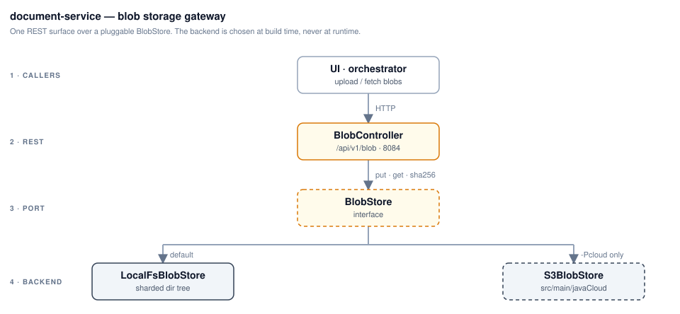

# document-service

Blob-storage gateway on **port 8084** — stores and serves every artifact the
platform exchanges: test plans, data-file zips, and post-run JTL results. One
`BlobStore` interface with two backends, chosen by `DOCUMENT_SERVICE_BACKEND`:
`LocalFsBlobStore` on a mounted directory (default), or `S3BlobStore` under a
`-Pcloud` build.

API contract: [`api/openapi.yaml`](api/openapi.yaml) — browsable at
<http://localhost:8084/swagger-ui.html>.
