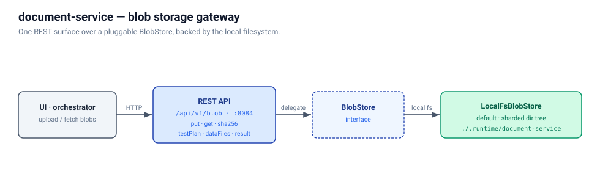

# document-service

HTTP gateway that abstracts blob storage (test plans, data zips, JTL
results) for the jmeter-cloud platform. Spring Boot 3.5.14 + Java 17.



Blob storage sits behind a pluggable `BlobStore` interface. The default
implementation, **`LocalFsBlobStore`**, is a local-filesystem blob store
that bind-mounts a host directory — what every developer gets out of the
box.

## REST API

| Method | Path | Purpose |
|--------|------|---------|
| `POST` | `/api/v1/blob` | Upload a blob; the body streams through a `DigestInputStream` (no in-memory buffering). Three optional headers tag the upload: `X-Name` (human label, shown in the UI dropdown), `X-Description`, `X-Type` (`testPlan` / `dataFiles` / `result` / `other`). |
| `GET`  | `/api/v1/blob` | Paginated list of stored blobs filtered by `?type=…` with `?offset=&limit=` (limit clamped at 500). Newest-first. The UI launcher's dropdowns read this. |
| `GET`  | `/api/v1/blob/{blobId}` | Stream the bytes. Sets `Content-Type` from the recorded value and exposes `X-blobId`/`X-sha256` response headers for client-side verification. |
| `GET`  | `/api/v1/blob/{blobId}/metadata` | Metadata only — no bytes. |
| `DELETE` | `/api/v1/blob/{blobId}` | Idempotent delete (204 even if the blob never existed). Hard-deletes the bytes and sidecar. |

Plus actuator: `/actuator/health`, `/actuator/info`, `/actuator/prometheus`.

`blobId` is a server-issued ULID — 26 chars, Crockford base32, URL-safe,
lexicographically sortable by upload time. The controller validates the
shape on every path-param request to block traversal-style malformed
inputs.

The machine-readable contract lives in [`api/openapi.yaml`](api/openapi.yaml).

### Live API documentation

Interactive Swagger UI is served at runtime:
http://localhost:8084/swagger-ui.html.

## Storage — `LocalFsBlobStore`

The default `BlobStore` implementation. Bind-mounts
`${DOCUMENT_SERVICE_LOCAL_FS_ROOT}` from the host (default
`/var/lib/document-service/blobs` in-container). Layout:

```
{root}/
  {blobId[22..23]}/
    {blobId[24..25]}/
      {blobId}              ← raw bytes
      {blobId}.meta.json    ← sidecar (size, sha256, contentType, name, description, type, uploadedAt)
```

Sharded on the blobId's random suffix (uniform distribution) so each
leaf directory's entry count stays bounded. Writes are atomic: bytes go
to a `.tmp` sibling and `Files.move(ATOMIC_MOVE)` into place; a crash
mid-upload leaves a `.tmp` that's safely ignorable. If the underlying
filesystem doesn't support `ATOMIC_MOVE` (e.g., a Docker bind-mount
across filesystems), the writer falls back to `REPLACE_EXISTING` and
logs a `WARN`.

Listing walks the shard tree, reads each `.meta.json`, applies the type
filter, sorts newest-first, paginates. Acceptable up to a few thousand
blobs.

## Metrics

| Counter / Timer | Meaning |
|-----------------|---------|
| `documentService.blob.uploads`         | Successful uploads. |
| `documentService.blob.downloads`       | Successful downloads. |
| `documentService.blob.deletes`         | DELETE calls (existing or absent). |
| `documentService.blob.notFound`        | Requests targeting an unknown blobId. |
| `documentService.blob.upload.duration` | Wall-time per upload (sha + write + meta), histogram. |

## Running

```bash
# As part of the full stack:
cd .. && docker compose up document-service

# Standalone:
docker compose -f docker-compose.yml up
```

## Build & test

```bash
mvn package          # 30 MB JAR
mvn test             # unit tests
mvn verify           # + BlobLifecycleIT (LocalFsBlobStore behavior)
```

`BlobLifecycleIT` drives MockMvc against a real `LocalFsBlobStore`
rooted at a per-test temp directory. Four scenarios: full lifecycle
round-trip, malformed-id 404 (path-traversal guard),
DELETE-on-absent idempotency, and tag round-trip + type-filtered
listing.
