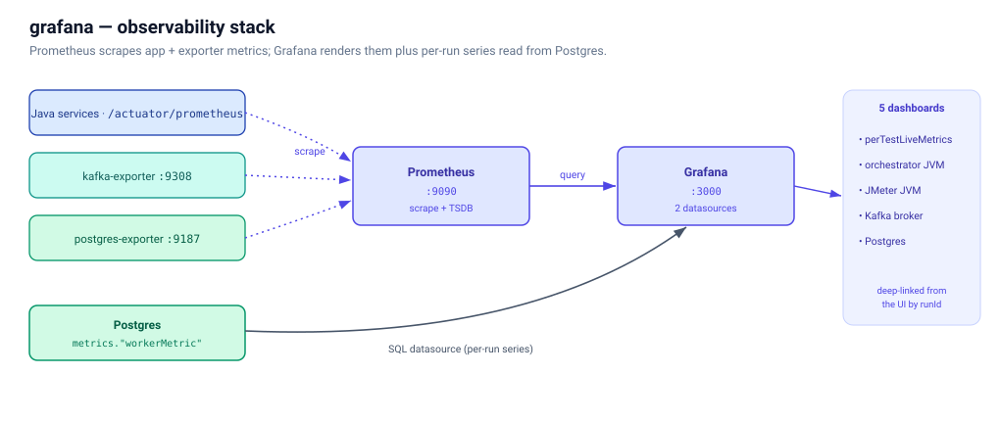

# grafana

Local observability stack for the jmeter-cloud platform — Prometheus +
Grafana + exporters, with five provisioned dashboards.



## What's in here

| File | Purpose |
|------|---------|
| `docker-compose.yml`                       | Brings up Grafana, Prometheus, kafka-exporter, postgres_exporter. |
| `prometheus.yml`                           | Scrape config — points Prometheus at the 4 Spring Boot services + the two exporters. |
| `provisioning/datasources/prometheus.yml`  | Auto-loads the Prometheus datasource on Grafana boot. |
| `provisioning/datasources/postgres.yml`    | Auto-loads the Postgres datasource (connects as `metricsReader`). |
| `provisioning/dashboards/loader.yml`       | Tells Grafana to load every JSON in `dashboards/`. |
| `dashboards/orchestratorJvm.json`          | JVM heap / GC / threads / HTTP per Spring Boot service. |
| `dashboards/jmeterJvm.json`                | "Worker Pod JVM" — orchestrator process (Spring Boot actuator `jvm_*`) and the JMeter child (`jmeter_jvm_*`, re-published from `JmxMetricsCollector` by the `JmeterJvmMetrics` MeterBinder) charted **side by side** (heap, GC, threads, CPU, classes) so you can tell which JVM is struggling. |
| `dashboards/kafkaBroker.json`              | Topic / partition / consumer-group metrics from kafka-exporter. |
| `dashboards/postgres.json`                 | Connection / transaction / cache-hit metrics from postgres_exporter. |
| `dashboards/perTestLiveMetrics.json`       | **Postgres-backed**, titled **"Application Performance Dashboard"** (UID stays `perTestLiveMetrics` — the UI deep-link contract). The `$runId` picker is time-range-filtered (only runs with data in the picker window; re-queries on range change) and offers **All** (`__all__` → aggregate across all runs in the window). Default picker now-1d. Queries `metrics."workerMetric"` directly. Per-`runId` (or All): 7 top stats (active workers, throughput, error rate, Avg/P90/P95/P99 — anchored on the run's latest minute), 4 fleet-aggregate graphs (throughput, response time Avg/P90/P95/P99, error %, status codes), active threads per worker, and two **collapsed** sections that only query when expanded (by-label throughput + avg RT; a JMeter-style aggregate report table). Time-series + report are bounded by the dashboard time picker via `$__unixEpochFilter` — the UI "Open in Grafana" deep-link sets the picker to the run's exact range. |

## Running

```bash
# Default profile brings up the full stack including grafana:
docker compose up -d

# Open Grafana — anonymous read access is enabled in local dev:
open http://localhost:3000/dashboards
```

The first time the stack boots, dashboards take ~30 s to appear in the
UI (Grafana's provisioning loader runs at startup + every 30 s).

## Editing dashboards

Edit JSON in this repo + reload — Grafana picks up changes within 30 s.

For UI-side edits: log in as `admin / admin` (or whatever you set
`GRAFANA_ADMIN_PASSWORD` to in `.env`), edit, then click "Save dashboard"
→ "Save JSON to file" and check the JSON into `dashboards/`. The
provisioning loader has `allowUiUpdates: true` so changes persist
during the session, but a container restart reloads from JSON.
