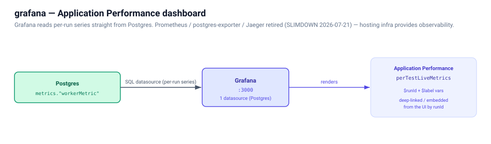

# grafana

The platform's one dashboard — **Application Performance**
(`perTestLiveMetrics`) — provisioned from this directory onto a Postgres
datasource reading `jmetercloud_metrics`. Grafana is the only remaining reader
of the raw `metrics."workerMetric"` table; the orchestrators all read the
rollups, so a reshape of that table breaks these panels first.

Dashboard of record:
[`dashboards/perTestLiveMetrics.json`](dashboards/perTestLiveMetrics.json).
Its percentile expressions must keep `::BIGINT` inside every product and
`::FLOAT` on every division numerator, matching
`metrics."rebuildRunRollups"` and the consumer's delta CTE — a test catches
those two drifting apart, but nothing catches this file.
