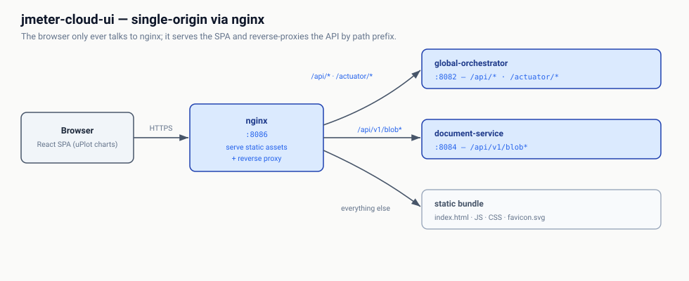

# jmeter-cloud-ui

The control-plane SPA on **port 8086** — applications, documents, templates,
per-(group, region) capacity, workflows (group-scoped task graphs drawn in
React Flow), the run launcher and run detail with native uPlot charts. React 18 + Vite 5 + TypeScript, served by nginx, which reverse-proxies
the API surface so the browser only ever talks to one origin: `/api/v1/blob/*`
goes to `document-service`, everything else under `/api/*` and `/actuator/*` to
the `global-orchestrator`.

One image serves both environments — `DNS_RESOLVER` and `SVC_SUFFIX` are
derived at container start, because nginx's `resolver` skips resolv.conf search
domains and in-cluster upstreams must therefore be FQDNs.

API contract: the global-orchestrator's
[`api/openapi.yaml`](../jmeter-global-orchestrator/api/openapi.yaml), plus
[document-service's](../document-service/api/openapi.yaml) for the blob routes.
