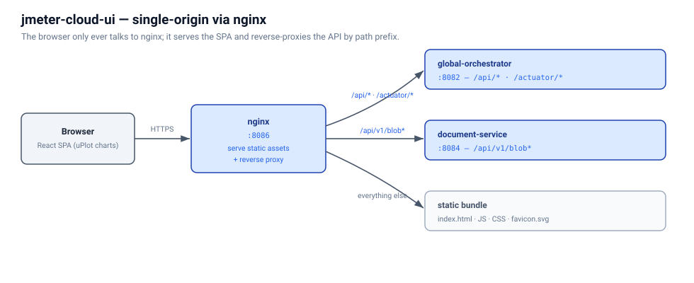

# jmeter-cloud-ui

React + Vite + TypeScript control plane for the jmeter-cloud platform.
Multi-route SPA served by nginx; nginx reverse-proxies the API surface
to the right backend so the browser only ever talks to one origin:

- `/api/v1/blob[/...]` → `document-service:8084` (blob upload / list / download / delete).
- `/api/*` and `/actuator/*` → `global-orchestrator:8082` (run management, pod registry, log proxy).



## Stack

- React 18, TypeScript 5.6, Vite 5.4.
- React Router 6 — client-side routing with HTML5 history mode.
- Hand-rolled CSS in `src/styles.css`. No CSS framework.
- Charting: [uPlot](https://github.com/leeoniya/uPlot) (~17 KB gzip) for
  the native run-metrics charts (replaces the Grafana iframes since
  HM-3 / HM-7). Bundle is ≈ 101 KB gzip total under a 120 KB cap.
- nginx (runtime) serves the static bundle + proxies the API calls.
  Multi-stage Dockerfile: `node:20` build → `nginx:1.27` runtime.
  Streaming uploads up to 1 GB via `client_max_body_size 1024m` +
  `proxy_request_buffering off` on the blob route.

## Routes

| Path | What |
|------|------|
| `/` | Landing page — quick links + global-orchestrator actuator health. |
| `/runs` | Table of active + recent runs. Polls `GET /api/v1/runs?state=…` every 5 s. Multi-select checkboxes capped at **2 runs** (selecting a third drops the oldest pick); when 2 are selected the "Compare 2 runs →" link navigates to `/runs?compare=A,B`. |
| `/runs?compare=A,B` | **Two-run comparison** (HM-7 / Phase 2). Two-column header showing each run's summary + a colored swatch matching its line on the chart, then a single `<TwoRunMetricsPanel>` with three native uPlot charts (TPS, Avg RT, Error %) overlaid. Time-axis toggle: **Elapsed-from-`fromSecond`** (default) anchors each run at its own start so "did this PR move the needle?" is a one-click read; **Absolute UTC** keeps wall-clock for same-time analysis. Status codes deliberately omitted in compare view (single-run view still shows them). Strict 2-id contract — handed-typed `?compare=A` or `?compare=A,B,C` renders an error. |
| `/runs/new` | Run-launcher form. Test-plan + data-files inputs are type-filtered dropdowns populated from `GET /api/v1/blob?type=…`. Today: a single `fleetSize` number input, `region` text field, and `labelFilter` CSV. POSTs to `/api/v1/runs`; on success navigates to `/runs/{runId}`. Surfaces server `code` + `message` inline (e.g. `INSUFFICIENT_CAPACITY` links to `/runs` so the operator can see what's holding the pods). |
| `/blobs` | Blob library — drag-and-drop uploader with XHR-backed progress bar (cancel button bridges `AbortSignal` → `xhr.abort()`), paginated table of stored blobs, per-row delete + download. Uploads tag `X-Name`/`X-Description`/`X-Type` so blobs are discoverable in the launcher dropdown. |
| `/runs/:runId` | Run metadata + fleet-member table + **native `<MetricsTabPanel>`** (HM-3 — 4 uPlot charts driven by `GET .../timeseries`, replaced the Grafana iframe so historical runs render correctly) + per-pod inline log tail. Polls `GET .../status` every 5 s; pauses polling on terminal state. Log tail polls `GET .../members/{workerId}/logs` every 2 s with pause-on-hover, level + regex filter, smart auto-scroll. **↗ Open in Grafana** deep-link still available for power-user drill-down with explicit `from`/`to` bounds. |

Unknown paths redirect to `/`.

## API client

Two typed clients mirror the corresponding OpenAPI specs:

- `src/api/runs.ts` — global-orchestrator (`Run`, `RunFleetMember`,
  `StartRunRequest`, `MetricsTimeseries`, `MetricsTimeseriesBatch`,
  plus `runsApi.start/list/get/status/podLogs/timeseries/timeseriesBatch`).
- `src/api/blobs.ts` — document-service (`BlobMetadata`, `BlobListing`,
  plus `blobsApi.upload/list/get/delete/metadata`). `upload()` is XHR-
  backed for progress events; the rest are `fetch`-based.

Errors surface as `GlobalOrchestratorError` / `DocumentServiceError`
with `httpStatus` + `code` so the UI can react to the well-known codes
(`INSUFFICIENT_CAPACITY`, `INVALID_REQUEST`, `RUN_NOT_FOUND`,
`BLOB_NOT_FOUND`).

## Configuration

| Env var | Default | What |
|---------|---------|------|
| `VITE_GRAFANA_URL` | `http://localhost:3000` | Base URL the **↗ Open in Grafana** deep-link in `<MetricsTabPanel>` points at (the in-page chart panel itself is native uPlot since HM-3; the deep-link is for power-user drill-down). Override at build time: `VITE_GRAFANA_URL=https://grafana.example.com npm run build`. |

The Grafana deep-link URL is built in `src/config.ts`
(`grafanaPerTestDeepLink(runId, fromMs, toMs)`) and points at the
provisioned `perTestLiveMetrics` dashboard
(`grafana/dashboards/perTestLiveMetrics.json`). The link includes
EXPLICIT `from`/`to` epoch-ms bounds derived from the run's window so
finished runs render the right slice (Grafana's default
`now-3h` would otherwise show empty for runs that completed
yesterday).

## Running

```bash
# As part of the full stack:
cd .. && docker compose up jmeter-cloud-ui
open http://localhost:8086

# Standalone (still needs document-service + global-orchestrator reachable
# on the docker network — wire those via the same Compose file or
# docker-compose.override.yml):
docker compose -f docker-compose.yml up

# Local dev (no Docker — Vite HMR on http://localhost:5173):
npm install
npm run dev
```

## Build & test

```bash
npm install
npm run lint        # tsc --noEmit
npm run test        # vitest run (single shot)
npm run test:watch  # vitest in watch mode
npm run build       # tsc -b && vite build → dist/
```

The Dockerfile prefers `npm ci` if a lockfile is present. Commit
`package-lock.json` after `npm install` for reproducible builds.

Test pickup is restricted to `src/**/*.test.{ts,tsx}` in
`vite.config.ts` because the project keeps `.js` siblings alongside
every `.ts/.tsx` source from earlier `tsc -b` runs — without the
filter, vitest double-counts every test from the compiled JS sibling.

## Polling behavior

The run-detail page (`/runs/:runId`) and the two-run comparison page
(`/runs?compare=A,B`) together run **four independent polling loops**.
All four pause aggressively so a 50-100 pod fleet doesn't generate a
wall of network traffic when the operator isn't actively watching.

| Loop | Cadence | Pauses on | Used by |
|------|---------|-----------|---------|
| Run-status snapshot | 5 s | terminal run state | `RunDetailPage` (drives the fleet-member table) |
| Per-stream tail | 2 s | terminal + visibility gates (4 of them) | `<LogTailPanel>` (Console + Logs tabs, one stream at a time) |
| Metrics timeseries (single) | 5 s | terminal run state + browser-tab visibility | `<MetricsTabPanel>` (4 native uPlot charts via `useMetricsTimeseries`) |
| Metrics timeseries (two-run) | 5 s | **both** runs terminal + browser-tab visibility | `<TwoRunMetricsPanel>` (3 overlaid charts via `useTwoRunTimeseries` — HM-6) |

### Page-level run-status poll (5 s)

`RunDetailPage` polls `GET /api/v1/runs/{runId}/status` every 5 s via
`useInterval`. The global-orchestrator's `refreshAndGet` resolves the
fleet-member states server-side (one round-trip per refresh,
regardless of fleet size), so this poll is constant cost. It pauses
once the run reaches a terminal state (`COMPLETED` / `FAILED` /
`ABORTED`) — completed runs don't change.

The fleet-member table on the page reflects per-node state on every
tick: `PENDING → REQUESTED → ACCEPTED → RUNNING → COMPLETED / FAILED /
ABORTED`.

### Per-stream tail poll (2 s) — `useVisiblePolling`

The Console / Logs tabs in `<RunStreamsPanel>` poll
`GET /api/v1/runs/{runId}/members/{workerId}/logs?stream=…&tail=N`
through the `useVisiblePolling` hook. **One stream is in flight at a
time**, regardless of fleet size — the tab strip + worker selector
narrow the active polling to (active worker × active tab).

The hook stops the timer when **any** of these gates closes:

| Gate | When it closes | Why |
|------|----------------|-----|
| `delayMs === null` | Run is terminal OR the selected pod's member state is terminal | Frozen log file + frozen ring buffer — nothing new will appear. |
| `paused` | Operator ticks the "Pause polling" checkbox | Manual override. |
| `document.visibilityState === 'hidden'` | Browser tab moves to background | No human is watching. |
| `IntersectionObserver !isIntersecting` | The log `<pre>` element is scrolled out of view | No human is watching this panel even within the foreground tab. |

The hook returns `{isPaused, pauseReason}`; the panel surfaces the
reason as a small badge so the operator never wonders "did the panel
break, or did I just minimize the window?"

### Metrics timeseries poll (5 s) — `useMetricsTimeseries` (HM-3)

`<MetricsTabPanel>` polls `GET /api/v1/runs/{runId}/timeseries` every
5 s via `useMetricsTimeseries`, which wraps `useVisiblePolling`. The
response feeds 4 native uPlot charts (TPS, Avg RT, Error %, Status
codes) — replaces the prior Grafana iframe so historical runs render
correctly (the iframe defaulted to `now-3h`; finished runs from
yesterday showed nothing).

The hook stops the timer when:

- Run is terminal (`COMPLETED` / `FAILED` / `ABORTED`) — DB rows
  for that runId won't change anymore.
- Browser tab is hidden — same gate as the per-stream tail poll.

The hook also exposes a `refresh()` callback for the panel's manual
**↻ Refresh** button. When the user clicks **↗ Open in Grafana** the
deep-link includes EXPLICIT `from`/`to` epoch-ms bounds derived from
the run's window — so Grafana renders the right slice even for runs
that completed days ago.

### Two-run comparison metrics poll (5 s) — `useTwoRunTimeseries` (HM-6)

`<TwoRunMetricsPanel>` polls `GET /api/v1/runs/timeseries?ids=A,B`
every 5 s via `useTwoRunTimeseries` (sibling of the single-run hook;
also wraps `useVisiblePolling`). One round-trip pulls both runs'
timeseries; the panel overlays them in three charts (TPS, Avg RT,
Error %) — status codes are deliberately omitted in the comparison
view because overlaying both runs' code mixes adds visual clutter for
marginal extra signal.

The hook stops the timer when:

- **BOTH** runs are terminal — even if one is still running, polling
  continues so the live side updates and the static side stays in
  sync. Only when both have settled does the loop go to sleep.
- Browser tab is hidden — same gate as the single-run version.

The comparison page is gated on **exactly two distinct run ids**: the
`RunsListPage` selection toolbar caps picks at 2 (a third selection
replaces the oldest), and `RunsComparePage` renders an error if a
hand-typed URL carries 1 or 3+ ids. The strict cap keeps the chart
legend, color palette and URL contract ergonomic.

### Tab switching = full unmount

Inactive tabs in `<RunStreamsPanel>` literally don't exist in the React
tree (conditional render) — switching from Console to Metrics
**unmounts** the `LogTailPanel` and any of its `useEffect`s. This is
the load-bearing fleet-scale guarantee:

- 100-pod run, operator on the Metrics tab → 0 log requests in flight.
- 100-pod run, operator on Console tab, worker dropdown set to
  `worker-37` → 1 request every 2 s (only `worker-37`).
- 100-pod run, operator switches browser tabs → 0 requests until they
  come back.

Verified by the
`RunStreamsPanel — fleet-scale safety guarantee` vitest cases
(`src/components/__tests__/RunStreamsPanel.test.tsx`).

### Overriding the auto-pause

The operator-facing "Pause polling" checkbox in `<LogTailPanel>` and
the manual **↻ Refresh** button in `<MetricsTabPanel>` are the only
deliberate overrides. There is intentionally **no** "always poll,
ignore visibility" toggle — the fleet-scale cost makes it the wrong
default. If a long-running observability tool needs continuous data,
open the **↗ Open in Grafana** deep-link from the Metrics tab; that
opens the full Grafana dashboard with the run's exact time range and
its own auto-refresh inside Grafana's tab.

## Manual smoke tests

### Drag-and-drop a blob and launch a run

```bash
docker compose up -d --build
open http://localhost:8086/blobs
# Drag a .jmx file → set X-Type=testPlan → upload completes via XHR
#   progress bar.
# Open http://localhost:8086/runs/new → the upload appears in the
#   "Test plan" dropdown.
# Pick it, set fleet size = 1, click Start → page redirects to
#   /runs/{runId} with live metrics + log tail.
```

### Two parallel runs side by side

```bash
docker compose --profile multiRegion up -d --build
# orchestrator-1 + orchestrator-2 self-register. Both appear at
# /api/v1/pods with state=IDLE.

# Launch run-A then run-B (each claims a different pod from the
# registry). Open /runs → both rows visible, polling every 5 s.
# Multi-select both rows → "Compare 2 runs →" → native overlaid
# charts (TPS / Avg RT / Error %) for both runs in one view, with
# elapsed-from-start alignment by default. Toggle to Absolute UTC
# if you want wall-clock alignment instead.
```
