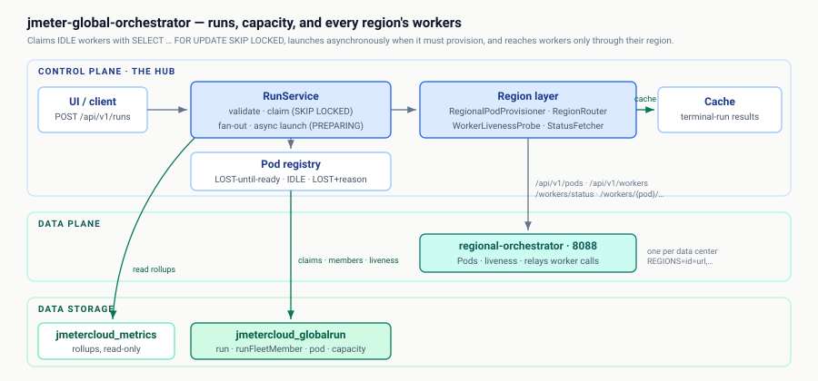

# jmeter-global-orchestrator

The control plane on **port 8082**: owns the application registry (applications
and the application groups that route their metrics and own their worker pools —
`/api/v1/applicationGroups`), per-(group, region) capacity, run state and the pod registry in the
`ORCH_*` tables of the one Oracle schema `CARDZATE_DB_GRAF`, claims IDLE pods one row at a time with
`FOR UPDATE SKIP LOCKED` (the `ORCH_CLAIMS` package), and fans a run out to many
workers. It holds no cluster credential: clusters register at runtime in
`ORCH_REGION` (`POST /api/v1/regions`, validated against the cluster's
`jmeter-regional-orchestrator` before anything is written — CLUSTER-CAPACITY),
workers are created and reached through that regional, and an operator-declared
worker is dialled directly at its hub-reachable `baseUrl`. Groups reserve
capacity on at most two clusters, under each cluster's worker ceiling. It also
runs **workflows** — group-scoped task graphs (health checks, load tests,
emails, waits, approvals) advanced by a DB-claim engine, one execution per
replica per tick.

API contract: [`api/openapi.yaml`](api/openapi.yaml) — browsable at
<http://localhost:8082/swagger-ui.html>.
