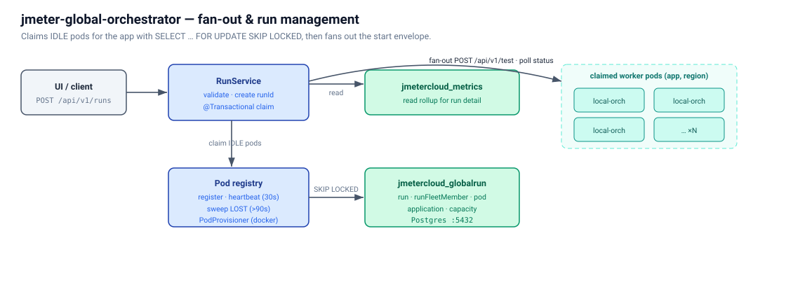

# jmeter-global-orchestrator

Fan-out layer that drives many `jmeter-local-orchestrator` instances across
regions / clusters. Owns fleet-wide run state in Postgres, coordinates
fleet-wide test starts, and reads aggregated metrics from the metrics DB
replica.



Spring Boot 3.5.14 + Java 17. `POST /api/v1/runs` claims IDLE pods
from the registry, fans out `POST /api/v1/test` calls in a bounded
thread pool, persists run state, and rolls up live status on
`GET /api/v1/runs/{id}/status`. Pod selection is registry-driven:
local orchestrators self-register on boot and heartbeat every 30 s; a
background sweeper marks stale pods LOST after 90 s.

## REST API

| Method | Path | Purpose |
|--------|------|---------|
| `POST` | `/api/v1/runs` | Start a fleet-wide run; fans out to claimed pods, returns 201 with persisted state. |
| `GET`  | `/api/v1/runs?state=active&limit=N` | List recent runs (filter `active` excludes terminal states). |
| `GET`  | `/api/v1/runs/{runId}` | Run definition + fleet member list (no live refresh). |
| `GET`  | `/api/v1/runs/{runId}/status` | **Live-refreshed** aggregated state — polls each non-terminal member's local orchestrator and rolls up. |
| `GET`  | `/api/v1/runs/{runId}/metrics` | Per-label metrics rollup from the metrics DB. |
| `GET`  | `/api/v1/runs/{runId}/timeseries` | **Per-second timeseries (HM-1).** Aggregated TPS, TPS-weighted mean response time (`avgRespTimeMs` per HM-1A), error %, and per-status-code counts, keyed by `windowSecond`. Server-side downsamples when raw point count exceeds 1500 (`bucketSize > 1`). Drives the four native uPlot charts in the run-detail Metrics tab (HM-3); replaced the previous Grafana iframe so historical runs render correctly. |
| `GET`  | `/api/v1/runs/timeseries?ids=A,B` | **Batched timeseries for the two-run comparison view (HM-5 / Phase 2).** Returns `{runs: {A: {...}, B: {...}}, missing: [...]}` in one round-trip. Strict 2-id contract — single-run goes through `/timeseries`, three or more is out of scope. Partial-200 if one id is purged. Drives `<TwoRunMetricsPanel>` (HM-6) in the comparison page. |
| `GET`  | `/api/v1/runs/{runId}/members/{workerId}/logs?tail=N` | Proxies the per-pod log tail (`text/plain`) through the global so the UI only ever talks to one origin. |

Plus actuator: `/actuator/health` (includes Postgres connectivity via the
primary `runStateDataSource`), `/actuator/info`, `/actuator/prometheus`.

`runId` is a server-issued ULID — 26 chars, Crockford base32. Path
parameters that don't match the ULID shape return 404 short-circuited.

The machine-readable contract lives in [`api/openapi.yaml`](api/openapi.yaml).

### Live API documentation

Interactive Swagger UI is served at runtime:
http://localhost:8082/swagger-ui.html.

## Postgres wiring (two datasources)

| DB | Mode | Role | What |
|----|------|------|------|
| `jmetercloud_globalrun` | read-write | `globalOrchestratorWriter` | **Primary.** `globalOrchestrator.run` + `runFleetMember`. |
| `jmetercloud_metrics`   | read-only  | `metricsReader` | Per-label rollup for `GET .../metrics`; per-second timeseries for `GET .../timeseries` (HM-1) and the batched `GET /runs/timeseries` (HM-5). Both queries are partition-prune-safe — month-old runs don't scan every weekly partition of `metrics."workerMetric"`. |

Wired by `config/DataSourceConfig.java`. Spring Boot's auto-config bows
out because both `DataSource` beans are explicit. Hikari pools are
sized 10/2 — bump for heavier load.

## Run lifecycle

```
PREPARING → STARTING → RUNNING → DRAINING → COMPLETED
                          ↓                      │
                       FAILED ←──────────────────┘
                          ↓
                       ABORTED
```

The aggregate state rolls up from per-pod `runFleetMember.state` —
member states are independent (`PENDING → REQUESTED → ACCEPTED →
RUNNING → COMPLETED|FAILED|ABORTED`). `GET .../status` polls each
non-terminal member's local orchestrator and updates the stored
member states inline.

## Pod registry

Each `jmeter-local-orchestrator` self-registers at boot and pings
`POST /api/v1/heartbeat` every 30 s. A background sweeper marks pods
`LOST` when `lastHeartbeat` is older than
`globalOrchestrator.pod.lostAfterMs` (default 90 s). Run-launch claims
IDLE pods with `SELECT … FOR UPDATE SKIP LOCKED` so concurrent
launches can't double-claim, and the claim+INSERT pair runs in a
single transaction.

| Endpoint | Owner |
|----------|-------|
| `POST /api/v1/registerPod` | Local orchestrator's `PodRegistrar` on boot. Idempotent. Optionally carries `applicationId` (Phase 1 capacity rework). |
| `POST /api/v1/heartbeat`   | Local orchestrator every 30 s. 404 → re-register inline. |
| `GET  /api/v1/pods`        | Admin / UI view of the registry. |

`POST /runs` returns 503 `INSUFFICIENT_CAPACITY` when fewer than
`fleetSize` IDLE pods are registered with fresh heartbeats.

Per-region claims (Track F shipped) — `StartRunRequest` carries
`fleetAllocation: [{region, count}, …]`; the claim is per-region
`SELECT … FOR UPDATE SKIP LOCKED`. `GET /api/v1/regions` is the
capacity-rollup the launcher polls. Phase 4 of the **Capacity
rework** tightens the claim further to filter by
`(applicationId, region)` so per-app pods are never claimed by another
app's run.

## Pod provisioner (Phase 1 of Capacity rework — local-only)

`com.perf.globalorchestrator.provision.PodProvisioner` drives the
local docker daemon over a mounted `/var/run/docker.sock` to spin up
per-application local-orchestrator containers named
`{appName}-{region}-worker-{n}`. Configured via the
`globalOrchestrator.podProvisioner.*` block in `application.yml`
(env-var overridable). Container labels under
`com.perf.jmeterCloud.*` let the reconciler list/adopt managed
containers without going through the registry table.

## Metrics

| Counter | Meaning |
|---------|---------|
| `globalOrchestrator.runs.started`           | Total runs started. |
| `globalOrchestrator.runs.failed`            | Runs whose fan-out failed entirely. |
| `globalOrchestrator.runs.claimShortfalls`   | POST /runs requests that hit `INSUFFICIENT_CAPACITY` (fewer IDLE pods than `fleetSize`). |
| `globalOrchestrator.fanouts.accepted`       | Per-pod fan-out calls accepted. |
| `globalOrchestrator.fanouts.rejected`       | Per-pod fan-out calls rejected. |
| `globalOrchestrator.pods.registrations`    | Successful POST /registerPod calls. |
| `globalOrchestrator.pods.heartbeats`       | Successful POST /heartbeat calls. |
| `globalOrchestrator.pods.unknownHeartbeats`| Heartbeats from podIds the registry doesn't know (caller likely needs to re-register). |
| `globalOrchestrator.pods.markedLost`       | Pods flipped from IDLE to LOST by the sweeper. |

Plus Hikari pool metrics for both pools, JVM, and the Spring MVC
request timer.

## Running

```bash
# As part of the full stack:
cd .. && docker compose up global-orchestrator

# Standalone (requires Postgres + Flyway-applied schema reachable):
docker compose -f docker-compose.yml up
```

## Build & test

```bash
mvn package          # default fat JAR
mvn test             # unit tests
mvn verify           # + behavior IT (RunManagementIT)
```

Four behavior IT suites:

`RunManagementIT` boots Spring against a Testcontainers Postgres,
applies the canonical `globalrun` Flyway migration as the superuser,
and stubs the per-pod local-orchestrator with WireMock. Three
scenarios:

1. POST → fan-out POST /test → run RUNNING → GET /status reflects
   RUNNING after a live poll.
2. GET /runs/{unknown} → 404 RUN_NOT_FOUND.
3. POST /runs without testPlanBlobId → 400 INVALID_REQUEST.

`PodRegistryIT` exercises the registry SQL paths — register +
idempotent re-register + heartbeat + 404 on unknown podId; stale-pod
sweep + recovery; `GET /pods` listing.

`MetricsTimeseriesIT` (HM-1, 5 cases) drives both `globalrun` and
`metrics` Flyway migration sets in one Postgres container (distinct
history tables — see the `@BeforeAll` for the rationale). Asserts
the per-second SQL aggregation: empty/PREPARING returns 200 + empty
arrays (not 404); 404 on unknown runId; throughput + JSONB status-code
merges across multiple workers + labels are correct per-second; sibling
runs don't bleed into the queried run; long runs (1600+ s) trigger
server-side downsampling with `bucketSize > 1` and the bucket sums
equal the raw totals. The fixture seeds DISTINCT values per percentile
column so a SQL bug that picks the wrong column would be caught.

`MetricsTimeseriesBatchIT` (HM-5, 5 cases) covers the two-run batch
endpoint: happy 2-run path (response order matches query order, runs
don't bleed); partial-200 with `missing` list when one id is unknown;
both-missing returns empty `runs` map + full `missing` (still 200);
400 on missing/blank `ids`; 400 on count != 2 (covers 1, 3, and the
dedupe-to-1 edge `?ids=DUPE,DUPE`).
