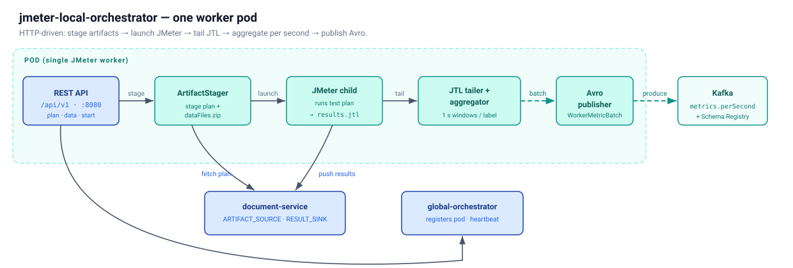

# jmeter-local-orchestrator

A lightweight HTTP-driven orchestrator that runs alongside a single JMeter
worker. It accepts test artifacts over a
REST API, launches JMeter as a child process, tails the JTL result file in
real time, aggregates rows into one-second tumbling windows per endpoint
label, and publishes `WorkerMetric` Avro records to Kafka.



One process per host. One JMeter worker. One test at a time. The next
test clears the previous run's results and logs before starting;
uploaded artifacts (test plan, data files) persist until you re-upload
them.

The sibling `jmeter-global-orchestrator` fans out tests across many of
these local orchestrators. This project owns the per-host complexity so
the global layer stays thin.

The container image bakes Apache JMeter 5.6.3 alongside the orchestrator
JAR, so a single image runs both the orchestrator and the JMeter child
process — no sidecar, no master/slave RMI.

Published records land on Kafka topic `jmeter.metrics.perSecond`, keyed
`{region}|{workerId}|{label}`.

---

## What it does

- **Owns the JMeter lifecycle.** Launches JMeter as a child process when the
  API is called, monitors its health, and shuts it down cleanly on demand or
  on `SIGTERM`.
- **Accepts test artifacts over HTTP.** Upload a `.jmx` and a `.zip` of data
  files (up to 512 MB, streamed); start a test; query status. No image
  rebuilds to change a test plan.
- **Streams JMeter results to Kafka in real time.** Tails the JTL output,
  aggregates rows into one-second tumbling windows per endpoint label,
  computes percentiles via HDRHistogram, publishes Avro `WorkerMetric`
  records.
- **Exposes JMeter JVM metrics** via JMX on `GET /metrics/jmeterJvm`.
- **Uploads results post-test** to a configurable backend (HTTP or a
  generic Document Service) — or keeps them local for ad-hoc retrieval.
- **Self-contained.** A single container runs both the orchestrator and its
  JMeter child process — no sidecar, no master/slave RMI.

---

## Key Design Constraints

| Constraint | Rationale |
|------------|-----------|
| Lightweight (< 512 MB RSS, < 60 MB JAR, < 3% CPU at 300 rps) | Runs on the same host as JMeter; must not steal load-generator resources. |
| One test per instance | Matches operational model; eliminates state stores and `runId` routing |
| JMeter plugins baked into the image | Avoids runtime plugin uploads and JMeter restarts |
| Singleton REST resources, no path parameters | Routing is trivial; no `/{runId}/...` ambiguity |
| Highly configurable (env + per-run overrides) | The same binary adapts via env vars + per-run `POST /test` overrides |

---

## Network Ports

Single source of truth for every port the system uses. No two services
compete for the same host port.

| Port | Owner | Scope | Notes |
|------|-------|-------|-------|
| `8080` | Orchestrator HTTP API | Host | `HTTP_PORT` env override; the contract with the upstream UI |
| `8081` | Confluent Schema Registry | Host (local dev) | `SCHEMA_REGISTRY_URL` |
| `8085` | Kafka UI (local dev only) | Host | Remapped from container's 8080 to keep host 8080 free for the orchestrator |
| `9092` | Kafka EXTERNAL listener | Host | Used by the orchestrator when run on the host |
| `29092` | Kafka INTERNAL listener | Container-to-container | Schema Registry / Kafka UI use this; never exposed to the host |
| `9093` | Kafka KRaft controller | Container-only | Internal quorum |
| `9999` | JMX (orchestrator → JMeter child) | `localhost`-only | `JMX_PORT` env override; never reachable off-host |

---

## REST API at a glance

Base path `/api/v1`. All paths are static — no path parameters.

| Category | Endpoint | Purpose |
|----------|----------|---------|
| Test plan  | `POST   /testPlan`             | Upload a `.jmx` (or `.zip` containing one) |
|            | `GET    /testPlan`             | Metadata of the currently uploaded plan |
|            | `GET    /testPlan/file`        | Download the raw plan |
|            | `DELETE /testPlan`             | Remove the plan |
| Data files | `POST   /dataFiles`            | Upload a `.zip` (≤ 512 MB, streamed to disk) |
|            | `GET    /dataFiles`            | Manifest (file list, sha256, sizes) |
|            | `GET    /dataFiles/file`       | Re-download the original zip |
|            | `DELETE /dataFiles`            | Clear data files |
| Test       | `POST   /test`                 | Start a test (clears previous results, launches JMeter) |
|            | `GET    /test`                 | Current state (or last completed) |
|            | `DELETE /test`                 | Graceful stop (SIGTERM → drain) |
|            | `POST   /test/abort`           | Hard kill (SIGKILL → mark `ABORTED`) |
| Results    | `GET    /results`              | JTL metadata (size, row count, upload state) |
|            | `GET    /results/file`         | Stream the raw JTL |
|            | `DELETE /results`              | Clear the JTL |
| Observability | `GET /metrics/jmeterJvm`   | JMeter heap, GC, threads (via JMX) |
|            | `GET    /metrics/orchestrator` | Orchestrator's own counters |
|            | `GET    /logs?tail=200`        | Tail of `jmeter.log` |
| Platform   | `GET    /health`               | Liveness (cheap) |
|            | `GET    /ready`                | Readiness (deep — Kafka reachable, disk OK). Independent of test state: a `RUNNING` test returns 200 |
|            | `GET    /info`                 | Build, version, host, current run |
|            | `GET    /metrics`              | Prometheus exposition |
|            | `GET    /config`               | Effective config (secrets redacted) |

A `POST /test` with a new `runId` implicitly clears the previous run's JTL
and logs. Trying to start a new test while one is `RUNNING` returns `409`.

The machine-readable contract lives in [`api/openapi.yaml`](api/openapi.yaml).

### Live API documentation

Interactive Swagger UI is served at runtime:
http://localhost:8080/swagger-ui.html.

---

## Lifecycle

```
IDLE
  │
  ├─ POST /testPlan ──────► test plan stored on disk        (replaces previous)
  │
  ├─ POST /dataFiles ─────► data-file zip extracted         (replaces previous)
  │
  ├─ POST /test ───────────► PREPARING ─► STARTING ─► RUNNING ─► DRAINING ─► COMPLETED
  │                                                                              │
  │                                                       (if AUTO_UPLOAD_RESULTS)
  │                                                       JTL gzipped + uploaded
  │                                                       to RESULT_SINK
  │                                                                              │
  │                                                                            IDLE
  │
  ├─ DELETE /test ─────────► graceful stop (SIGTERM, drain, mark ABORTED)
  └─ POST /test/abort ─────► hard kill (SIGKILL, mark ABORTED)
```

The inner `RUNNING` super-state is driven by the existing
`TailerStateMachine` (`WAITING_FOR_FILE → RUNNING → DRAINING → DONE`).

**Crash recovery:** the JTL byte offset is persisted to
`${RESULTS_DIR}/.jtlOffset` every 10 s. On orchestrator restart, the
tailer resumes from the saved position. Kafka's idempotent producer
deduplicates any re-sent windows.

---

## Storage Backends (artifacts in, results out)

**Inputs** (test plan, data files) and **outputs** (JTL results) flow through
separate, independent backends.

### `ARTIFACT_SOURCE` — how artifacts arrive

| Backend | Value | When |
|---------|-------|------|
| HTTP upload (always available) | `HTTP_UPLOAD` (default) | Direct CI uploads; local dev |
| Document Service (Maven profile `-Pstorage-docservice`, +0 MB) | `DOCUMENT_SERVICE` | Fetch artifacts from the document service |

### `RESULT_SINK` — where the JTL goes after `COMPLETED`

| Backend | Value | When |
|---------|-------|------|
| Keep local; client pulls via `GET /results/file` | `HTTP_UPLOAD` (default) | Local dev; any environment where the doc service is not reachable |
| Document Service (Maven profile `-Pstorage-docservice`) | `DOCUMENT_SERVICE` | Once the doc service is live |

**Auto-upload targets the document service only** — that one HTTP gateway
hides whatever underlying storage the doc service backs onto, so the
orchestrator itself never needs to know about the concrete storage for
results.

### `AUTO_UPLOAD_RESULTS` — master switch

Defaults to `false`. With it off, the orchestrator does no post-test work
— the JTL stays on local disk and the upstream UI fetches it via
`GET /results/file`. Flip to `true` only after the document service is
reachable; then a `COMPLETED` test gzips the JTL and pushes it to
`RESULT_SINK=DOCUMENT_SERVICE`.

Setting `AUTO_UPLOAD_RESULTS=true` requires `RESULT_SINK=DOCUMENT_SERVICE`
and a non-empty `DOCUMENT_SERVICE_URL`. The orchestrator refuses to start
with `AUTO_UPLOAD_RESULTS=true` and `RESULT_SINK=HTTP_UPLOAD` — that
combination would silently never upload anything, so the misconfiguration
is surfaced at boot rather than at end-of-test.

The Document Service (sibling `document-service` subsystem) is an HTTP
gateway that hides the underlying storage behind one REST API. Wiring the
orchestrator to fetch plans by
blobId from the document-service is an open follow-up; today the
orchestrator stages plans through its own `POST /api/v1/testPlan`
upload slot.

---

## Kafka Message Format

**Topic:** `jmeter.metrics.perSecond`
**Key:** `{region}|{workerId}|{label}` — deterministic partition assignment, filterable without deserialisation
**Value:** Avro `WorkerMetric` — schema lives in the `kafka/` subsystem at [`kafka/schemas/WorkerMetric.avsc`](../kafka/schemas/WorkerMetric.avsc) (canonical location for both producer and consumer).

| Field | Type | Description |
|---|---|---|
| `windowSecond` | long | Unix epoch second for this window |
| `workerId` | string | Worker identity — pod name |
| `region` | string | Region, e.g. `us-east-1` |
| `label` | string | JMeter sampler label, e.g. `POST /api/payment` |
| `throughput` | long | Requests completed in this second |
| `errorRate` | double | `errorCount / throughput` (0.0–1.0) |
| `p50Ms`…`p99Ms` | double | HDRHistogram percentiles |
| `maxMs` | double | Clamped histogram maximum (≤ 3,600,000 ms) |
| `rawMaxMs` | long | True unclamped maximum — use for timeout detection |
| `statusCodes` | map<string,long> | Response code frequency, e.g. `{"200":330,"503":3}` |

---

## Configuration

Every value has an env-var default and a per-run override in the `POST /test`
body. Override hierarchy: **request body > env var > built-in default**.
`GET /api/v1/config` returns the effective resolved config (secrets
redacted).

**Required env vars (startup):**

| Variable | Description |
|----------|-------------|
| `KAFKA_BROKERS` | Bootstrap servers |
| `SCHEMA_REGISTRY_URL` | Confluent Schema Registry URL |
| `KAFKA_TOPIC` | Target topic (typically `jmeter.metrics.perSecond`) |
| `TEST_REGION` | Region tag, e.g. `us-east-1` |
| `POD_NAME` | Worker identity |

**Notable optional env vars:**

| Variable | Description | Default |
|----------|-------------|---------|
| `HTTP_PORT` | REST API port | `8080` |
| `BASE_DIR` | Root directory for orchestrator-managed files | `/opt/jmeter` |
| `JMETER_HOME` | JMeter installation root | `/opt/jmeter` |
| `JMETER_JVM_ARGS` | Default JVM args for the JMeter child (heap + native-region caps so it fails fast inside its own accounting before the cgroup OOM-kills it) | `-Xms2g -Xmx2g -XX:+ExitOnOutOfMemoryError -XX:MaxMetaspaceSize=256m -XX:MaxDirectMemorySize=512m -XX:ReservedCodeCacheSize=240m` |
| `JMETER_OOM_SCORE_ADJ` | `oom_score_adj` applied to the JMeter child so a shared-cgroup OOM reaps the child, never the orchestrator (PID 1). Range `[-1000,1000]`; `1000` = "kill me first"; `0` opts out | `1000` |
| `MAX_DATA_ZIP_SIZE_MB` | Cap on data-file upload size | `512` |
| `ARTIFACT_SOURCE` | `HTTP_UPLOAD` / `DOCUMENT_SERVICE` | `HTTP_UPLOAD` |
| `RESULT_SINK` | `HTTP_UPLOAD` / `DOCUMENT_SERVICE` | `HTTP_UPLOAD` |
| `AUTO_UPLOAD_RESULTS` | Auto-upload JTL after test completes | `false` |
| `AUTH_TOKEN` | Static bearer token for the API (empty = disabled) | _(empty)_ |
| `APPLICATION_ID` | Phase 1 capacity rework: the application this pod is bound to. Set by `jmeter-global-orchestrator`'s `PodProvisioner` when spinning up a per-app worker. Threaded through `POST /api/v1/registerPod` so the global registry knows which app this pod serves. Optional during the Capacity Phase 1 → Phase 6 migration window — legacy static pods register without it. | _(empty)_ |
| `WORKER_ID_SOURCE` | `POD_NAME` (default). `THREAD_NAME` is a legacy master-slave mode kept for back-compat — single-worker-per-pod is the supported model. | `POD_NAME` |
| `KAFKA_HEALTH_CHECK_INTERVAL_MS` | Background `/ready` probe interval | `30000` |
| `KAFKA_HEALTH_CHECK_TIMEOUT_MS` | Per-probe AdminClient request timeout | `5000` |
| `MIN_FREE_DISK_MB` | `/ready` returns 503 when free disk drops below this many MB. Default `0` disables the gate; set a positive value (e.g. `1024`) to opt in. | `0` |
| `JMETER_TERMINATION_GRACE_S` | SIGTERM→SIGKILL grace for the JMeter child on `DELETE /test` | `120` |
| `ORCHESTRATOR_SHUTDOWN_GRACE_S` | JVM shutdown hook grace. Raise it for long-running tests so an in-flight run can drain cleanly. | `30` |

---

## Build

```bash
# Default fat JAR (HTTP_UPLOAD only — no doc service client)
mvn package

# With Document Service backend (+0 MB; uses JDK HttpClient)
mvn package -Pstorage-docservice

# Tests
mvn test           # unit only
mvn verify         # unit + integration (Testcontainers spins up Kafka + Schema Registry)
```

**Requirements:** Java 21, Maven 3.9+, internet access for Confluent
repositories on first build.

The Avro codegen plugin runs automatically during `generate-sources` and
produces `WorkerMetric.java` in `target/generated-sources/avro/`.

---

## Project Structure

```
src/
└── main/java/com/perf/orchestrator/
    ├── OrchestratorMain.java             @SpringBootApplication entry point
    ├── http/                             @RestController classes
    ├── lifecycle/                        TestRunManager, JMeter process mgmt
    ├── storage/                          ArtifactSource / ResultSink + backends
    ├── metrics/                          JMX collector, Prometheus exporter
    ├── logs/                             Log tail ring buffer
    ├── config/                           Env-var configuration (OrchestratorConfig)
    ├── model/                            JtlRow value type
    ├── parser/                           CSV parsing
    ├── io/                               File polling, sentinel, state checkpoint
    ├── aggregator/                       1-second tumbling windows
    ├── kafka/                            spring-kafka publisher
    └── statemachine/                     TailerStateMachine

src/test/                                 Mirrors main; *IT.java for integration
src/test/scripts/simulateJtl.sh           JTL fixture generator for the streaming pipeline

# Avro schema lives in the sibling kafka/ subsystem:
../kafka/schemas/WorkerMetric.avsc        Canonical schema (producer + consumer)
```

---

## Documentation

| Doc | What it covers |
|-----|----------------|
| [`api/openapi.yaml`](api/openapi.yaml) | OpenAPI 3.0 spec for every REST endpoint — paste into Swagger UI / Redoc, or generate clients with `openapi-generator` |

---

## Quick Start (local)

```bash
# 1. Start Kafka stack (KRaft + Schema Registry + Kafka UI at localhost:8085)
docker compose -f docker/docker-compose.yml up -d

# 2. Build
mvn package -DskipTests

# 3. Set env and run the orchestrator
set -a && source .env.local && set +a
java -jar target/jmeter-local-orchestrator-*.jar
```

Drive the API (upload a plan, start a test, watch progress) from the
interactive Swagger UI at http://localhost:8080/swagger-ui.html, then
consume the published metrics from Kafka with
`../kafka/scripts/consumeMetrics.sh` (requires `kcat`).
