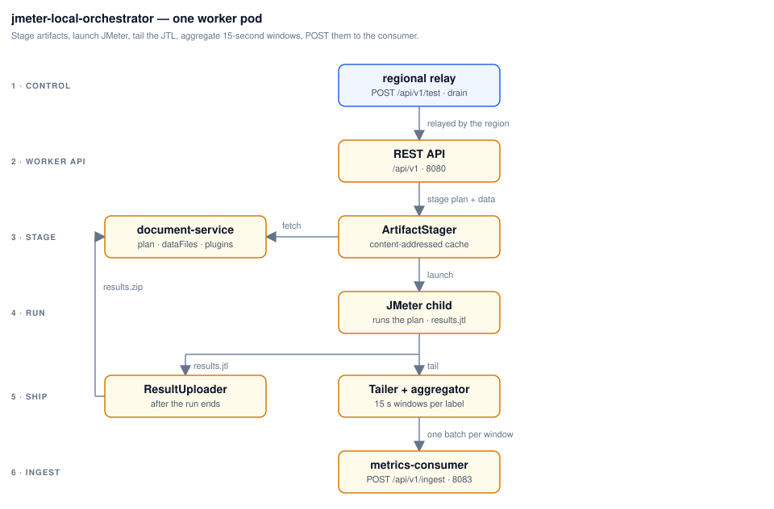

# jmeter-local-orchestrator

The worker: a Spring Boot 3 service (Java 21) that runs alongside one JMeter
process on **port 8080**, launching it as a child, tailing its JTL, and
aggregating each second into a `WorkerMetricBatch` it POSTs to the
metrics-consumer. Delivery is disk-buffered and retried, so a consumer or
network outage costs nothing but latency.

API contract: [`api/openapi.yaml`](api/openapi.yaml) — browsable at
<http://localhost:8080/swagger-ui.html>. Design detail lives in
[`docs/orchestratorPlan.md`](docs/orchestratorPlan.md); ports are allocated in
the root [`RUNBOOK.md`](../RUNBOOK.md) §4.
