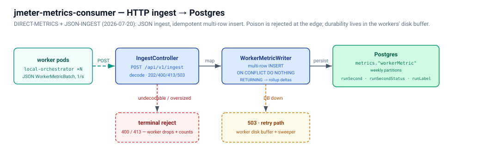

# jmeter-metrics-consumer

HTTP ingest service on **port 8083** and the platform's only metrics path:
every `jmeter-local-orchestrator` worker POSTs one JSON `WorkerMetricBatch`
per window to `POST /api/v1/ingest?groupId=<group>`, and the service routes it
through `GROUP_REGISTRY` into that application group's fact table
(`cps` → `CPS_METRICS` in the `CARDZATE_DB_GRAF` schema) — run, worker and
labels resolved to the shared `RUN`/`WORKER`/`LABEL` dimensions, then a
first-write-wins insert on `(RUN_ID, WORKER_ID, LABEL_ID, WINDOW_SECOND)`, so
a worker replaying its disk buffer after an outage is always safe.



API contract: [`api/openapi.yaml`](api/openapi.yaml) — the canonical wire
schema for the whole platform, pinned by a golden-payload test in this service
and in the worker. Schema and its rules: `oracle/docs/metricsSchema.md`.

| Setting | Env | Default | Effect |
|---|---|---|---|
| `spring.datasource.url` / `username` | `ORACLE_METRICS_URL` / `ORACLE_METRICS_USER` | `…/FREEPDB1` / `CARDZATE_DB_GRAF` | connects **as the schema owner** (like the hosted proxy client), so every statement uses unqualified names |
| `metricsConsumer.maxRowsPerInsert` | `METRICS_MAX_ROWS_PER_INSERT` | 5000 | rows per JDBC batch |
| `metricsConsumer.auth.token` | `METRICS_AUTH_TOKEN` | blank | the bearer token; enforced under the `cloud` profile only |
| `metricsConsumer.groupCache.*` / `dimCache.*` | `GROUP_CACHE_TTL`, `GROUP_CACHE_MAX_SIZE`, `DIM_CACHE_TTL`, `DIM_CACHE_MAX_SIZE` | 24h / 1024, 24h / 100000 | per-instance caches of the registry row and the dimension ids |
| `spring.datasource.hikari.*`, `server.tomcat.threads.max` | `HIKARI_MAX_POOL_SIZE`, `HIKARI_MIN_IDLE`, `TOMCAT_MAX_THREADS` | 10 / 4 / 200 | sizing |

```bash
curl -s -XPOST 'localhost:8083/api/v1/ingest?groupId=cps' -H 'Content-Type: application/json' \
     --data @src/test/resources/goldenWorkerMetricBatch.json    # 202 {"rowsInserted":1,…}; 0 on replay
```
