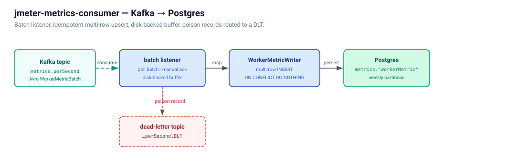

# jmeter-metrics-consumer

Spring Kafka consumer that reads `WorkerMetric` Avro records from
`jmeter.metrics.perSecond` and writes per-second rows into the
`jmetercloud_metrics` Postgres database.



Spring Boot 3.5.14, spring-kafka 3.3.15, Confluent Avro deserialiser,
Hikari pool against Postgres. The consumer is a **batch listener** — one
multi-row `INSERT … ON CONFLICT DO NOTHING` per Kafka poll, which keeps
the consumer ahead of the producer at fleet scale (target: 20k+ rows/s
on a single replica).

The PK collision contract `(runId, workerId, label, windowSecond)` makes
the writer idempotent: duplicate Kafka deliveries (rebalances, retries)
collapse to no-ops at the database. On failure the batch is retried 3×
(1 s back-off) then routed to `jmeter.metrics.perSecond.DLT`, drained on
demand by the `DlqReplayer` (see below).

## Tuning knobs

| Property | Default | What it does |
|----------|---------|--------------|
| `metricsConsumer.maxPollRecords` | `500`  | Upper bound on records per batch. |
| `metricsConsumer.fetchMaxWaitMs` | `1000` | Broker fetch wait — floor for batch latency at low ingest rates. |
| `metricsConsumer.concurrency`    | `3`    | Listener-container concurrency. Match to topic-partition count for full parallelism. |

Hikari pool sizing lives in `application.yml` (`maximum-pool-size: 8`,
`minimum-idle: 2`). Bump to 16-24 for heavier ingest.

## Metrics

| Counter / Timer | Meaning |
|-----------------|---------|
| `metricsConsumer.records.consumed`   | Records pulled from Kafka into the listener. |
| `metricsConsumer.records.inserted`   | Rows actually written to Postgres. |
| `metricsConsumer.records.duplicates` | Records collapsed by ON CONFLICT DO NOTHING. |
| `metricsConsumer.records.failures`   | Batches that failed to insert (will be retried / DLT'd). |
| `metricsConsumer.batch.duration`     | Wall-time per batch INSERT (Kafka receive → Postgres committed). Histogram. |

Plus the Spring Kafka / Hikari built-ins
(`kafka.consumer.records-consumed-total`, `kafka.consumer.fetch-latency-avg`,
`hikaricp.connections.active`, …).

## DLQ replay

When a batch fails 3× (1 s back-off each), Spring Kafka publishes the
records to `jmeter.metrics.perSecond.DLT`. The `DlqReplayer`
`CommandLineRunner` drains that topic and re-attempts the INSERT:

```bash
java -jar target/jmeter-metrics-consumer.jar \
     --spring.main.web-application-type=none \
     --metricsConsumer.dlqReplay=true
```

Records that still fail (e.g., poison-pill payloads that don't decode)
are logged with their topic / partition / offset so an operator can
triage via `kcat`. Replayer exits when the DLT is drained
(3 consecutive empty polls).

## Running

```bash
# As part of the full stack (default profile):
cd .. && docker compose up metrics-consumer

# Standalone (requires kafka + schema-registry + postgres reachable):
docker compose -f docker-compose.yml up
```

## Build & test

```bash
mvn package          # builds the fat JAR
mvn test             # unit tests only
mvn verify           # + behavior IT (Testcontainers Postgres + EmbeddedKafka)
```

The IT (`MetricsConsumerWriteIT`) boots a real Postgres via
Testcontainers, applies the canonical metrics migration with Flyway, and
produces Avro-encoded `WorkerMetric` records via Confluent's
`mock://` schema-registry scheme — no Confluent SR container needed.
Tests **behavior** (round-trip + idempotency), not exhaustive method
coverage.

The Avro plugin reads `WorkerMetric.avsc` from the sibling `kafka/schemas/`
directory, so the build context for the Dockerfile is the repo root.

## API

This service does not expose a public REST API. Spring Actuator endpoints:

| URL | Purpose |
|-----|---------|
| `http://localhost:8083/actuator/health`     | Aggregate health (DB + Kafka contributors). |
| `http://localhost:8083/actuator/prometheus` | Counter / timer / pool metrics for Prometheus scraping. |
| `http://localhost:8083/actuator/info`       | Build info. |
