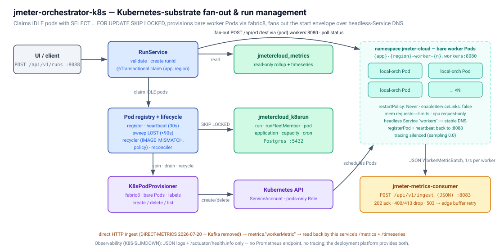

# jmeter-orchestrator-k8s

The Kubernetes-substrate control plane on **port 8088**: the same orchestrator
as `jmeter-global-orchestrator`, provisioning worker Pods through fabric8
instead of a docker socket, with its own `jmetercloud_k8srun` database and its
own isolated namespace so it can coexist with the umbrella deployment on one
cluster.

> **This service and `jmeter-global-orchestrator` are two deployments of one
> control plane and must carry identical functionality.** Any change here is
> mirrored there with `./tools/portToTwin.sh`, and `./tools/parityCheck.sh` must
> exit 0 before it is done. Never blanket-rename `globalOrchestrator` — four
> names say "global" in both services on purpose. See `tools/README.md`.

API contract: [`api/openapi.yaml`](api/openapi.yaml) — browsable at
<http://localhost:8088/swagger-ui.html>.
