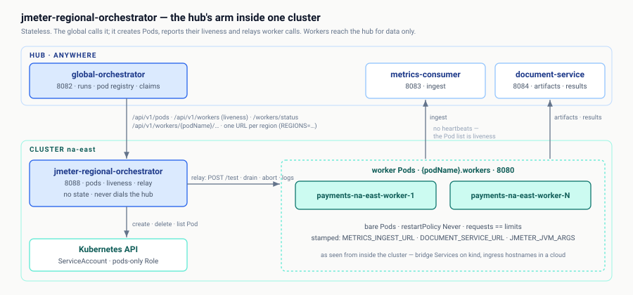

# jmeter-regional-orchestrator

The in-cluster arm of the global orchestrator on **port 8088**, one per
data-center cluster: it creates and deletes worker Pods through its own
ServiceAccount, reports their liveness straight from the Pod list, and relays
the global's calls to workers whose DNS is cluster-private. It holds no state
and never calls the hub — the global is its only client, and workers call the
hub for data (metrics, artifacts) only.

API contract: [`api/openapi.yaml`](api/openapi.yaml) — browsable at
<http://localhost:8088/swagger-ui.html>.
