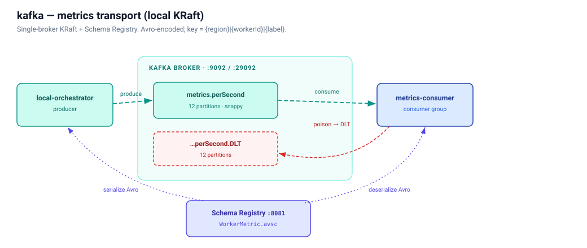

# kafka/

Local Kafka stack for the jmeter-cloud platform. Single-broker KRaft + Schema Registry + Kafka UI + topic initialiser. Canonical Avro schemas live in `schemas/`.

This README is the **single source of truth for the topic naming convention**. Producers (`jmeter-local-orchestrator`) and consumers (`jmeter-metrics-consumer`) both depend on these names being predictable.



---

## Topic naming convention

**Rule:** `jmeter.metrics.<applicationId>` for the per-app metrics topic.

**Dead-letter (DLT) suffix:** `jmeter.metrics.<applicationId>.DLT`. Mirrors Spring Kafka's default `DeadLetterPublishingRecoverer` shape; auto-derived by the consumer's error handler.

**Examples:**

| Application | Main topic | DLT |
|---|---|---|
| `checkoutSvc` | `jmeter.metrics.checkoutSvc` | `jmeter.metrics.checkoutSvc.DLT` |
| `paymentApi` | `jmeter.metrics.paymentApi` | `jmeter.metrics.paymentApi.DLT` |
| `searchSvc` | `jmeter.metrics.searchSvc` | `jmeter.metrics.searchSvc.DLT` |

**Why this shape:**

- **`jmeter.` prefix** — service-first naming. All metrics topics group together in Kafka UI's lexical sort. In a shared cluster, the prefix unambiguously identifies "this is from the JMeter platform" and lets per-team ACLs use a single wildcard policy.
- **`metrics.` segment** — what kind of data. Distinct from any future audit / event topics that might also key on `applicationId`.
- **`<applicationId>` suffix** — application name from the `application` registry (camelCase, DNS-style, ≤ 64 chars per `ApplicationController`'s validation). The dot separator before `<applicationId>` is what makes the consumer regex `[^.]+$` group cleanly.
- **No grain word.** The aggregation grain (1-second windows) is part of the message **schema**, not the topic name. Including it (`...perSecond.<app>`) implied rollup topics at other grains, which we don't have or want — long-tail rollups live in Postgres, not in another Kafka topic.
- **Service comes before app, not the other way around.** `jmeter.metrics.checkoutSvc` not `checkoutSvc.metrics`. Kafka best-practice: prefix shared by everything you'd apply a single policy to (retention, ACL, quota). All metrics topics should retain for the same window; only the app-suffix varies.

**Consumer pattern subscription:**

```yaml
spring:
  kafka:
    listener:
      topic-pattern: "jmeter\\.metrics\\.[^.]+$"
```

The regex matches `jmeter.metrics.<appId>` and DOES NOT match `jmeter.metrics.<appId>.DLT` because `.DLT` adds a second `.` segment after `<appId>` — the `[^.]+$` clamps to "exactly one dot-segment after `metrics.`". A separate listener handles DLT topics: `jmeter\\.metrics\\..+\\.DLT$`.

---

## Topic name length + character budget

Kafka allows topic names matching `[a-zA-Z0-9._-]{1,249}`. Our applicationId regex (per `ApplicationController`) is `^[a-z0-9]([-a-z0-9_]{0,62}[a-z0-9])?$` — a **strict subset** of Kafka's allowed chars, so any valid applicationId produces a valid topic name without escaping.

Length budget:

| Component | Max chars | Worst-case |
|---|---|---|
| `jmeter.metrics.` prefix | 15 | 15 |
| applicationId | 64 (per validator) | 64 |
| `.DLT` suffix (DLT topic only) | 4 | 4 |
| **Total** | — | **83** chars |

Well under Kafka's 249-char limit. No truncation needed.

---

## Today vs after KAFKA-PER-APP

| Era | Topics | Producer | Consumer |
|---|---|---|---|
| **Today (single-topic)** | `jmeter.metrics.perSecond` + `jmeter.metrics.perSecond-dlt` | All apps publish to one topic. `OrchestratorConfig.kafkaTopic` env-var defaults to `jmeter.metrics.perSecond`. | One `@KafkaListener` topic name. |
| **After KAFKA-PER-APP** | `jmeter.metrics.<appId>` + `....DLT` per registered app. Auto-created at `POST /api/v1/applications` time via `AdminClient`. | Per-run topic dispatch — global-orchestrator passes `kafkaTopic = "jmeter.metrics." + run.application` in the start-test envelope. | Pattern subscription `jmeter\\.metrics\\.[^.]+$`. Kafka rediscovers new topics every `metadata.max.age.ms` (set to 30 s on the consumer for fast new-app pickup). Separate DLT listener with pattern `jmeter\\.metrics\\..+\\.DLT$`. |

The cutover is a hard cutover — no dual-write window.

---

## Container memory limits (local stack)

Docker Desktop shares one RAM ceiling across every container on the host. When the sum of all containers' resident sets approaches that ceiling, the kernel OOM-killer fires on whichever container is biggest at that instant — often Kafka, because its on-heap + page-cache footprint outsizes everyone else's. The cascade is then: Kafka exits 137 → metrics-consumer's listener loses its broker → consumer crashes → operator restarts the stack manually.

To prevent that, the local stack pins per-container memory and CPU on the load-bearing services. Pick limits with headroom above the JVM heap so native buffers + page cache still fit:

| Service | `mem_limit` | `mem_reservation` | Heap (Xmx) | Why |
|---|---|---|---|---|
| `kafka` | `2g` | `1g` | ~1 GB (cp-kafka default) | 2 GiB leaves room for native buffers + page cache + log-segment cache without inviting the host OOM-killer |
| `metrics-consumer` | `1200m` | `768m` | 1 GB | Caps JVM heap + native overhead at 1.2 GiB so a Kafka OOM doesn't pull it down too |

**When you add a new service to the local stack** with a JVM heap > 256 MB, set both `mem_limit` (heap + ~25% overhead) and `mem_reservation` (heap, so the scheduler reserves it). Don't leave the default unlimited — that's how Docker Desktop hosts get into OOM cascades.

---

## Pointers

| Need | File |
|---|---|
| Canonical Avro schema (envelope + entry shape) | `schemas/WorkerMetricBatch.avsc` |
| Local stack composition (KRaft + SR + Kafka UI + topic-init) | `docker-compose.yml` |
