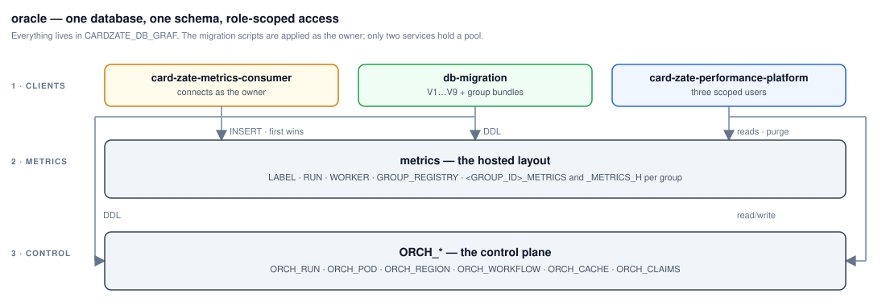

# oracle

The platform's database — Oracle Database Free locally (`gvenzl/oracle-free:23-slim`),
the operator's instance on the target infrastructure — one PDB, one schema
**`CARDZATE_DB_GRAF`**: the hosted metrics layout verbatim (`LABEL`, `RUN`, `WORKER`,
`GROUP_REGISTRY`, per group `<GROUP_ID>_METRICS` / `_METRICS_H` with its nightly
maintenance) beside the platform's `ORCH_*` control plane and the `ORCH_CLAIMS`
package. Every identifier is UPPER_SNAKE and unquoted, usernames included: the
metrics-consumer connects as the owner; `METRICS_READER`, `METRICS_PURGER` and
`GLOBAL_ORCHESTRATOR_WRITER` are the granted users.

| What | Where |
|---|---|
| Flyway `V1` (the hosted metrics layout), `V2` (the `ORCH_*` control plane + the users' grants) and each group's bundle (`R__group_<id>.sql`) | [`migrations/`](migrations/) |
| Group descriptors + the renderer that produces the bundles | [`groups/`](groups/) |
| Owner + users — the DBA hand-off, run once as SYS | [`initdb/`](initdb/) |
| Design and verified gates | [`docs/metricsSchema.md`](docs/metricsSchema.md), [`docs/controlPlaneSchema.md`](docs/controlPlaneSchema.md) |
