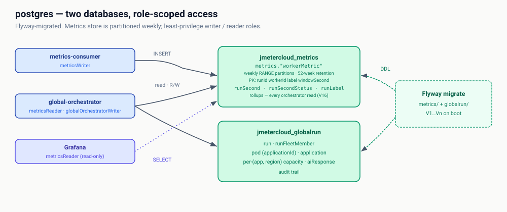

# postgres

The Postgres 16 instance behind the whole platform: `jmetercloud_metrics` holds
the weekly-partitioned `metrics."workerMetric"` fact table plus the rollups
every orchestrator read actually uses, and `jmetercloud_globalrun` /
`jmetercloud_k8srun` hold run state, the pod registry and per-(app, region)
capacity. Access is role-scoped — `metricsWriter`, `metricsReader`,
`metricsPurger`, `globalOrchestratorWriter` — so the consumer, the
orchestrators and Grafana each get only what they need.

Every identifier is camelCase via double-quoting; unquoted identifiers fold to
lowercase and break the column-name contract with the Java code.

Schema of record: the Flyway migrations under
[`migrations/`](migrations/) — `metrics/`, `globalrun/` and `k8srun/`, the last
two of which must always carry the same version. Design and measurements:
[`docs/schemaOptimization.md`](docs/schemaOptimization.md).
