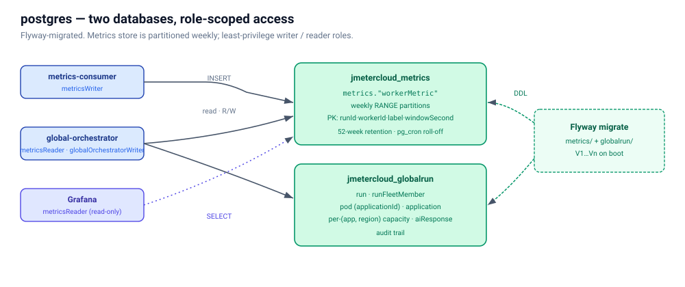

# postgres



Postgres 16 instance shared by:

- `jmeter-metrics-consumer` (writer) — bulk-INSERTs `WorkerMetric` rows
  into `metrics."workerMetric"` as the `metricsWriter` role.
- `jmeter-global-orchestrator` (writer + reader) — owns `globalOrchestrator.run`,
  `runFleetMember`, and `pod` as `globalOrchestratorWriter`; reads the
  metrics rollup as `metricsReader`.
- `grafana` (reader) — provisioned datasource that backs the
  `perTestLiveMetrics` dashboard.

All identifiers use the project-wide camelCase convention via Postgres
double-quoting; unquoted identifiers would fold to lowercase and break
the column-name contract with the Java code.

## Local

```bash
# Start (the default Compose profile includes postgres):
docker compose up -d postgres

# Connect as the cluster owner:
psql -h localhost -p 5432 -U jmetercloud -d jmetercloud_metrics
# Password: localdev
```

## Databases

| Database | Schema(s) | Notes |
|----------|-----------|-------|
| `jmetercloud_metrics`   | `metrics` | Partitioned `metrics."workerMetric"` table (RANGE on `windowSecond`, weekly partitions). Composite PK `(runId, workerId, label, windowSecond)` is the producer→consumer idempotency contract — duplicate Kafka deliveries collapse to no-ops via `INSERT … ON CONFLICT DO NOTHING`. Secondary index on `(runId, label, windowSecond)` for cross-fleet drill-downs. |
| `jmetercloud_globalrun` | `globalOrchestrator` | `run` (one row per fleet-wide run), `runFleetMember` (one row per pod participating in a run), `pod` (registry of self-registered local orchestrators). |

## Roles

| Role | Privileges | Used by |
|------|-----------|---------|
| `jmetercloud` | Cluster owner. | `psql` admin work; Flyway runs as this role. |
| `metricsWriter` | `INSERT, SELECT` on `metrics."workerMetric"` (and every partition). SELECT is required because the consumer uses `INSERT … ON CONFLICT DO NOTHING` which probes the unique index. | `jmeter-metrics-consumer`. |
| `metricsReader` | `SELECT` on `metrics."workerMetric"`. | `jmeter-global-orchestrator`'s rollup endpoint, Grafana's Postgres datasource, kafka/postgres exporters' health probes. |
| `globalOrchestratorWriter` | Full RW within `globalOrchestrator` schema. | `jmeter-global-orchestrator`. |

## Migrations

Flyway 10 runs as a one-shot Compose service (`flyway-migrate`) before
the consumers start:

| File | Database |
|------|----------|
| `migrations/metrics/V1__metricsSchema.sql`        | `jmetercloud_metrics` |
| `migrations/globalrun/V1__globalOrchestratorSchema.sql` | `jmetercloud_globalrun` |
| `migrations/globalrun/V2__podRegistry.sql`        | `jmetercloud_globalrun` |

The metrics schema's `createWeeklyPartition` helper grants
`INSERT, SELECT` to `metricsWriter` on each new partition (Postgres
doesn't propagate parent grants to children). The migration finalises
by GRANT-looping over the partitions it pre-created so the very first
run inserts cleanly.

`metrics."ensureUpcomingPartitions"(8)` pre-creates 8 weeks of
partitions. Operationally this should run on a weekly schedule (e.g.
pg_cron).
